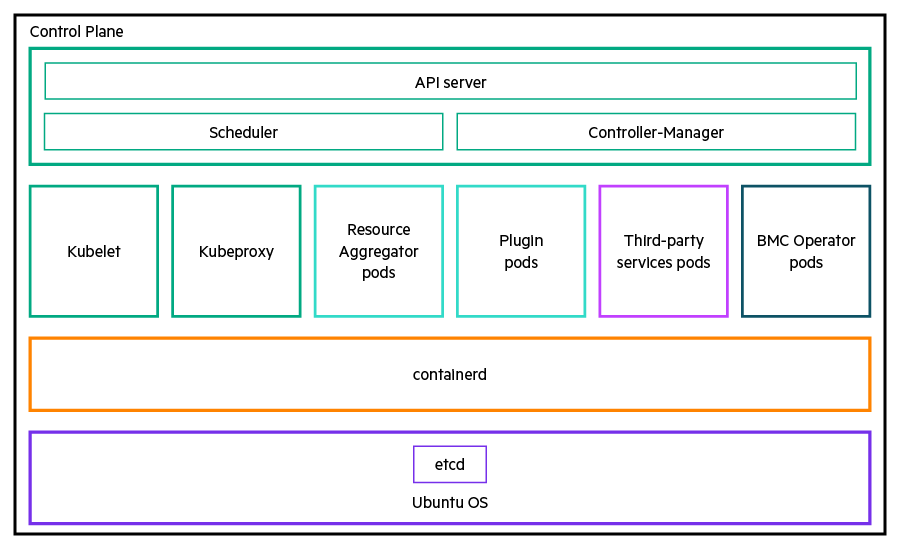

# Table of contents

[BMC Operator for Resource Aggregator for ODIM](#BMC-operator-for-Resource-Aggregator-for-ODIM)

- [BMC Operator architecture](#BMC-Operator-architecture)
- [Compatibility matrix](#Compatibility-matrix)
- [Related documentation](#Related-documentation)

[Pre-deployment operations](#Pre-deployment-operations)

[Deploying BMC Operator for ODIM](#Deploying-BMC-Operator-for-ODIM)

- [BMC Operator deployment configuration file](#BMC-operator-deployment-configuration-file)
- [Deployment configuration parameters](#Deployment-configuration-parameters)
- [Creating ODIM object](#Creating-ODIM-object)

[Role-based access control](#Role-based-access-control)

- [BMC Operator roles](#BMC-Operator-roles)
  - [Administrator](#Administrator)
  - [Operator](#Operator)
  - [User with read-only access](#User-with-read-only-access)
- [Linking user or service account to roles](#Linking-user-or-service-account-to-roles)

[BMC operations](#bmc-operations)

- [Adding a BMC](#adding-a-bmc)
- [Updating a BMC password](#Updating-a-BMC-password)
- [Resetting a BMC](#resetting-a-bmc)
- [Scenarios for powerState and resetType combinations](#Scenarios-for-powerState-and-resetType-combinations)
- [Deleting a BMC](#deleting-a-bmc)

[Applying BIOS settings on BMC](#Applying-BIOS-settings-on-BMC)

[Applying boot order settings on BMC](#Applying-boot-order-settings-on-BMC)

[Volume operations](#volume-operations)

- [Adding a volume](#adding-a-volume) 
- [Deleting a volume](#deleting-a-volume)

[Firmware operations](#firmware-operations)

- [Upgrading or downgrading firmware](#Upgrading-or-downgrading-firmware)
- [Verifying the firmware operation](#Verifying-the-firmware-operation)
- [Editing firmware](#Editing-firmware)
- [Deleting the firmware file](#Deleting-the-firmware-file)

[Creating an event subscription](#creating-an-event-subscription)

- [Validation of message IDs](#Validation-of-message-IDs)
- [Deleting an event subscription](#Deleting-an-event-subscription)

[Reconciliation](#reconciliation)

- [Reconciliation methods](#Reconciliation-methods)
- [Reconciliation operations](#Reconciliation-operations)
  - [BMC reconciliation use cases](#BMC-reconciliation-use-cases)
  - [BIOS reconciliation use cases](#BIOS-reconciliation-use-cases)
  - [Volume reconciliation use cases](#Volume-reconciliation-use-cases)
  - [Firmware reconciliation use cases](#firmware-reconciliation-use-cases)

[Using APIs in BMC Operator](#Using-APIs-in-BMC-Operator)

- [Prerequisites](#Prerequisites)
- [Sending API requests](#Sending-API-requests)
  - [Examples of API requests](#examples-of-API-requests)

[Uninstalling BMC Operator](#Uninstalling-BMC-operator)

[Contributing to the open source community](#contributing-to-the-open-source-community)

- [Creating a PR](#creating-a-pr)
- [Filing BMC Operator defects](#filing-bmc-operator-defects)
- [Licensing](#licensing)
- [Reference links](#reference-links)

[Sample configuration files](#Sample-configuration-files)

- [Sample BMC settings file](#sample-bmc-settings-file)
- [Sample BIOS settings file](#sample-bios-settings-file)
- [Sample boot order settings file](#sample-boot-order-settings-file)
- [Sample volume file](#sample-volume-file)
- [Sample firmware file](#Sample-firmware-file)

[Sample output properties](#Sample-output-properties)

- [BMC addition output](#BMC-addition-output)
- [Boot order settings output](#Boot-order-settings-output)
- [Volume addition output](#Volume-addition-output)
- [Firmware operation output](#Firmware-operation-output)
- [Event subscription output](#Event-subscription-output)

[Troubleshooting BMC Operator issues](#Troubleshooting-BMC-operator-issues)


# BMC Operator for Resource Aggregator for ODIM

Kubernetes operators introduce new object types through custom resource definitions (CRDs) that lists out all configurations available to the users. Users running workloads on Kubernetes often like to use automation to manage repeated tasks. They can use the custom resources (CRs) defined by the CRDs to define high-level configurations for the applications and resources. 

BMC Operator is the software extension of Kubernetes that uses CRs to manage various BMC operations that include the deployment and management of workloads of BIOS, boot order, volume, firmware, and event subscription operations. 

This document covers detailed, step-by-step instructions on the deployment procedures of BMC Operator on a deployment node. It also provides instructions on managing the supported resources.

## BMC Operator architecture

Here is the Resource Aggregator for ODIM architecture diagram with BMC operator.



For one-node deployment, the northbound management and orchestration systems access the BMC Operator through the controller IP address/hostname. BMC Operator further communicates with Resource Aggregator for ODIM through the same controller IP address/hostname. 

For three-node deployment, the northbound management and orchestration systems access the BMC Operator through the virtual IP address/hostname. BMC Operator further communicates with Resource Aggregator for ODIM through the same controller IP address/hostname. 

> **NOTE**: For information on Resource Aggregator for ODIM communications, see [*Resource Aggregator for Open Distributed Infrastructure Management™ Getting Started Readme*](https://github.com/ODIM-Project/ODIM/tree/development#readme). 


## Compatibility matrix

The following table lists the software components and their supported versions that are compatible with BMC Operator. These software components are used to deploy the BMC Operator.

| Software                     | Version  |
| ---------------------------- | -------- |
| Resource Aggregator for ODIM | 7.0.0    |
| Ubuntu LTS                   | 22.04.2  |
| Kubernetes                   | 1.24.6   |
| containerd                   | 1.6.8    |
| Docker                       | 20.10.12 |
| kubectl                      | 1.17.3   |
| Golang                       | 1.19.5   |


## Related documentation

This document is shipped with the following comprehensive set of Resource Aggregator for ODIM electronic documentation:

- [*Resource Aggregator for Open Distributed Infrastructure Management™ API Readme*](https://github.com/ODIM-Project/ODIM/blob/development/docs/README.md)—This document covers usage information for Resource Aggregator for ODIM including reference information for the northbound REST APIs that the management and orchestration systems use to communicate with southbound infrastructure elements through their respective plugins.
- [*Resource Aggregator for Open Distributed Infrastructure Management™ Getting Started Readme*](https://github.com/ODIM-Project/ODIM/tree/development#readme)—This document covers detailed deployment instructions of Resource Aggregator for ODIM and the plugins. You can also find information on post-deployment instructions and various use cases of Resource Aggregator for ODIM.
- [*Resource Aggregator for Open Distributed Infrastructure Management™ Troubleshooting Readme*](https://github.com/ODIM-Project/ODIM/blob/development/docs/Troubleshooting.md)—This document covers information on any common issues you might experience while deploying or using Resource Aggregator for ODIM and their possible workarounds. You can also find answers to some of the Frequently Asked Questions related to Resource Aggregator for ODIM.


# Pre-deployment operations

> **PREREQUISITES**: 
>
> Install kubectl on deployment node. 
> See *https://kubernetes.io/docs/tasks/tools/install-kubectl-linux/#install-kubectl-binary-with-curl-on-linux*.
>
> Link the deployment node to the Kubernetes cluster node using the following instructions:

1. Run the following command on the deployment node:

   ```
   mkdir -p $HOME/.kube
   ```

2. Copy `/etc/kubernetes/admin.conf` file from the cluster node to `$HOME/.kube` on deployment node.

   ```
   scp /etc/kubernetes/admin.conf bruce@{deploy_vm_ip}:/home/bruce/.kube
   ```

3. Run the following command on the deployment node: 

   ```
   mv $HOME/.kube/admin.conf $HOME/.kube/config
   ```

4. Change the localhost IP address in the  `config` file (check for `clusters`.`cluster`.`server` parameter) on the deployment node to that of the cluster node IP address, where Kubernetes cluster node is up.

5. Run the following command on the deployment node:

   ```
   sudo chown $(id -u):$(id -g) $HOME/.kube/config
   ```


# Deploying BMC Operator for ODIM

1. Clone the project by running the following command:

   ```
   git clone https://github.com/ODIM-Project/BMCOperator.git
   ```

2. Switch to the project branch.

3. Navigate to `/home/{user}/BMCOperator/bin` and change the permission of binaries to make it executable:


   ```
   chmod 775 *
   ```

4. Deploy the BMC Operator for ODIM on the deployment node:


   1. Navigate to BMC operator directory on the deployment node:

      ```
      cd /home/{user}/BMCOperator
      ```

   2. Build the Docker image of BMC operator:

      ```
      docker build -f dockerfiles/Dockerfile.bmcoperator -t odimra/bmc-operator:1.0.0 .
      ```

      > **NOTE**: Use the same image name.

   3. Save the Docker image:
   
      ```
      docker save -o {tar_filename}.tar odimra/bmc-operator:1.0.0
      ```

   4. Copy this image to a desired location on the cluster node(s).

      *In this instance, we save the image to `/home/{user}` on cluster nodes.*

      *`xxx.xxx.xxx.xxx` is the IP address of each cluster.*

      ```
      scp {tar_filename}.tar {username}@{xxx.xxx.xxx.xxx}:/home/{user}
      ```

   5. Log in to the cluster nodes and load the image on all cluster nodes in the home directory (three-node deployment):

      ```
      cd ssh {user}@{xxx.xxx.xxx.xxx}
      ```

      ```
      sudo ctr -n=k8s.io images import {tar_filename}.tar
      ```

   6. On the deployment node, deploy the BMC operator:

      ```
      make deploy
      ```

   7. Update the configuration parameters in the *[BMC Operator deployment configuration file](#BMC-operator-deployment-configuration-file)* and apply them.

      ```
      kubectl apply -f config/keys/config.yaml
      ```

   8. Copy `rootCA.crt` and `rootCA.key` from `home/bruce/ODIM/odim-controller/scripts/certs/{deployment_name}/` to `/home/{user}/BMCOperator/bmc-templates/keys/`.

   9. Run the following command to give permissions to generate keys and certificates:

      ```
      chmod 775 *
      ```

   10. Download yq package for keys generation. See the instructions in the link *https://www.cyberithub.com/how-to-install-yq-command-line-tool-on-linux-in-5-easy-steps/#Step_3_Install_yq*.

   11. Run the `gen_cert.sh` script to generate the required keys and signed certificates with rootCA.

       ```
       cd /home/{user}/BMCOperator/bmc-templates/keys
       ```

       ```
       ./gen_certs.sh {cluster_vm_ip}
       ```

   12. Apply the secret:
       ```
       cd /home/{user}/BMCOperator/bmc-templates/keys
       ```
       ```
       kubectl apply -f secret.yaml
       ```
    
   13. Navigate to BMC operator directory on the deployment node:

       ```
       cd /home/{user}/BMCOperator
       ```

   14. Apply the Persistent Volume and Persistent Volume Claim:

       ```
       kubectl apply -f bmc-templates/pvs/bmc_pv.yaml
       ```
    
       ```
       kubectl apply -f bmc-templates/pvs/bmc_pvc.yaml
       ```

   15. On each cluster node, create `operator_logs` directory in `/var/log` and give ownership to odimra user:

       ```
       sudo mkdir /var/log/operator_logs
       ```
       
       ```
       sudo chown odimra:odimra /var/log/operator_logs
       ```

   16. Check if operator pods are up and running:

       ```
       kubectl get pods -n{namespace}
       ```
       
       The following sample output appears:
       ```
       NAME                                           READY   STATUS    RESTARTS   AGE
       bmc-opcontroller-manager-5f54c64cd7-qkqdz      2/2     Running   0          17h
       ```


## BMC Operator deployment configuration file

> **PREREQUISITE**: Resource Aggregator for ODIM must be deployed and running on your system. See the [*Resource Aggregator for Open Distributed Infrastructure Management™ Getting Started Readme*](https://github.com/ODIM-Project/ODIM/tree/development#readme) for instructions on deploying Resource Aggregator for ODIM.

Before deploying the BMC Operator, update the deployment configuration file `config.yaml` available in the `config/keys` repository. It contains all the configuration information required to deploy the BMC Operator.

```
apiVersion: v1
kind: ConfigMap
metadata:
  name: {bmc-operator-config}
  namespace: {bmc_namespace}
  labels:
    type: config
data:
  config.yaml: |
    reconciliation : Accommodate #Accommodate/Revert
    eventSubReconciliation: Accommodate #Accommodate/Revert
    reconcileInterval: "24" #Time in `Hours` (in string)
    secretName: bmc-secret
    metricsBindPort: "8080"  # cannot change at runtime (in string)
    healthProbeBindPort: "8081" # cannot change at runtime (in string)
    eventClientPort: "45000" # cannot change at runtime (in string)
    logLevel: warn
    logFormat: syslog
    kubeConfigPath: # provide kube config file path as value when running with 'make install run' command
    namespace: {bmc_namespace}
    operatorEventSubscriptionEventTypes:
    - ResourceAdded
    - ResourceRemoved
    - Alert
    operatorEventSubsciptionMessageIds:
    - ResourceEvent.1.2.0.ResourceRemoved
    - ResourceEvent.1.2.0.ResourceAdded
    - iLOEvents.3.2.ServerPostDiscoveryComplete
    - iLOEvents.3.2.ServerPostComplete
    operatorEventSubsciptionResourceTypes:
    - ComputerSystems
```

> **NOTE**: We recommend you to have a regular backup of the latest deployment configuration file.


## Deployment configuration parameters

The following table lists and describes all the configuration parameters required to deploy BMC Operator.

| Parameter                             | Description                                                  |
| ------------------------------------- | ------------------------------------------------------------ |
| kind                                  | Kubernetes resource. Value is always `ConfigMap`.            |
| name                                  | Name of the `ConfigMap` Kubernetes resource.                 |
| namespace                             | Namespace in which the `ConfigMap` is applied.               |
| labels:type                           | Kubernetes object label for the BMC Operator `ConfigMap`.    |
| data:config.yaml                      | Contains all the following parameters for the BMC Operator.  |
| reconciliation                        | Type of reconciliation operation to be performed. For more information, see *[Reconciliation operations](#Reconciliation-operations)*. |
| reconcileInterval                     | Time interval in hours for which polling triggers.           |
| secretName                            | Secret name of the encryption keys for the BMC Operator.     |
| metricsBindPort                       | Metrics port for BMC operator.                               |
| healthProbeBindPort                   | Health port for BMC operator.                                |
| eventClientPort                       | HTTP server port listening to Resource Aggregator for ODIM events for event-based reconciliation. |
| logLevel                              | Enables you to set filters for your log levels based on your requirement. For more information, see *Log Levels* in *Appendix* in [*Resource Aggregator for Open Distributed Infrastructure Management™ Getting Started Readme*](https://github.com/ODIM-Project/ODIM/tree/development#readme). |
| logFormat                             | Enables logging in syslog format or JSON format.             |
| kubeConfigPath                        | Used for development process when BMC Operator runs with `make install` command. Keep this value empty when you deploy BMC Operator as a pod. |
| namespace                             | Namespace in which the BMC Operator is deployed.             |
| operatorEventSubscriptionEventTypes   | Array of event types required for BMC Operator to trigger reconciliation. Supported values are `ResourceAdded`, `ResourceRemoved` , and `Alert`. |
| operatorEventSubsciptionMessageIds    | Array of message IDs required for BMC Operator to trigger reconciliation. Supported values are `ResourceEvent.1.2.0.ResourceRemoved`, `ResourceEvent.1.2.0.ResourceAdded`, `iLOEvents.3.2.ServerPostDiscoveryComplete`, and `iLOEvents.3.2.ServerPostComplete`. |
| operatorEventSubsciptionResourceTypes | Array of resource types required for BMC Operator to trigger reconciliation. Supported value is `ComputerSystems`. |


## Creating ODIM object

This procedure is mandatory for managing BMCs.

1. Navigate to the `bmc-templates` directory. 

   ```
   cd /home/{user}/BMCOperator/bmc-templates
   ```

2. Open the `odim.yaml` file.

   ```
   vi odim.yaml
   ```

   The following content is displayed.

      ```
   apiVersion: v1
      kind: Secret
      metadata:
        name: {odimauth} 	
        namespace: {bmc_namespace} 
      type: BasicAuth/RedfishSessionAuth
      data:
       username: {base64_encoded_username}
       password: {encrypted_and_base64_encoded_password}
      ---
      apiVersion: infra.io.odimra/v1
      kind: Odim
      metadata:
        name: odim							     # do not change this value
        namespace: {bmc_namespace} 
        annotations:
          infra.io/auth: {odimauth} 				# same as metadata.name
      spec:
        URL: https://{ip}:{port}
        EventListenerHost: https://{cluster_node_ip}:{port}     #port: 32123
      ```

   For encrypting and base64 encoding of the password use the following commands:

   ```
   cd /home/{user}/BMCOperator/bmc-templates/keys
   ```

   ```
   echo -n '<odim_password>' | openssl pkeyutl -encrypt -pubin -inkey bmc.public -pkeyopt rsa_padding_mode:oaep -pkeyopt rsa_oaep_md:sha512| openssl base64 -A
   ```

3. Navigate to the `bmc-templates` directory.

   ```
   cd /home/{user}/BMCOperator/bmc-templates
   ```
   
4. Update the following parameters in the `odim.yaml` file.

   | Option                    | Definition                                                   |
   | ------------------------- | ------------------------------------------------------------ |
   | (Secret) type             | Defines the mode of authentication to register ODIM. Enter either of the two: BasicAuth/RedfishSessionAuth. |
   | (Secret) username         | The base64 encoded username of Resource Aggregator for ODIM. |
   | (Secret) password         | Encrypted and base64 encoded password of Resource Aggregator for ODIM. |
   | annotations.infra.io/auth | This value must be the same as secret `name`.                |
   | ip                        | IP address of Resource Aggregator for ODIM.                  |
   | port                      | Port of Resource Aggregator for ODIM.                        |
   | EventListenerHost         | Listens to the events received from Resource Aggregator for ODIM to the BMC Operator. |

5. Create instance of the ODIM custom resource:
   ```
   kubectl apply -f odim.yaml
   ```

6. Check if BMC Operator is able to connect to Resource Aggregator for ODIM:

   ```
   kubectl get odim -n{namespace}
   ```

   Upon successful connection, you get the following output:
   ```
   NAME   URL                           	 	STATUS      AGE
   odim   https://xxx.xxx.xxx.xxx:30080     	Connected   21d
   ```

   If the connection is unsuccessful, you get the following output:
   ```
   NAME   URL                              	STATUS     	 	AGE
   odim   https://xxx.xxx.xxx.xxx:30080    	Not Connected    	21d
   ```

   > **NOTE**: Check logs in `/var/log/operator_logs/bmc_operator.log` file in cluster VM.


# Role-based access control

Role-based access control (RBAC) is a method of managing access to computer or network resources based on the roles of individual users within your organization. RBAC authorization uses the `rbac.authorization.k8s.io` API group to drive authorization decisions, allowing you to configure policies through the Kubernetes API.

BMC Operator supports the following three roles as part of the RBAC:

- **bmc-op-admin**—Administrator who has authorization to perform all operations through BMC Operator. To view the authorized operations for this role, see *[Administrator](#Administrator)*.
- **bmc-op-operator**—User who has authorization to perform certain operations through BMC Operator. To view the authorized operations for this role, see *[Operator](#Operator)*.
- **bmc-op-readonly**—User with read-only access to the BMC Operator functions. To view the authorized operations for this role, see *[User with read-only access](#User-with-read-only-access)*.


## BMC Operator roles

This section lists the resources and the authorized operations of each user role.

### Administrator

| Resource                       | Operations                              |
| ------------------------------ | --------------------------------------- |
| biosschemaregistries           | create, get, list, patch, update, watch |
| biosschemaregistries/status    | get, patch, update                      |
| biossettings                   | create, get, list, patch, update, watch |
| biossettings/status            | get, patch, update                      |
| bmcs                           | create, get, list, patch, update, watch |
| bmcs/status                    | get, patch, update                      |
| bootordersettings              | create, get, list, patch, update, watch |
| bootordersettings/status       | get, patch, update                      |
| eventsubscriptions             | create, get, list, patch, update, watch |
| eventsubscriptions/status      | get, patch, update                      |
| firmwares                      | create, get, list, patch, update, watch |
| firmwares/status               | get, patch, update                      |
| odims                          | create, get, list, patch, update, watch |
| odims/status                   | get, patch, update                      |
| volumes                        | create, get, list, patch, update, watch |
| volumes/status                 | get, patch, update                      |
| eventsmessageregistries        | create, get, list, patch, update, watch |
| eventsmessageregistries/status | get, patch, update                      |

### Operator

| Resource                    | Operations                              |
| --------------------------- | --------------------------------------- |
| biosschemaregistries        | create, get, list, patch, update, watch |
| biosschemaregistries/status | get, patch, update                      |
| biossettings                | create, get, list, patch, update, watch |
| biossettings/status         | get, patch, update                      |
| bmcs                        | create, get, list, patch, update, watch |
| bmcs/status                 | get, patch, update                      |
| bootordersettings           | create, get, list, patch, update, watch |
| bootordersettings/status    | get, patch, update                      |
| firmwares                   | create, get, list, patch, update, watch |
| firmwares/status            | get, patch, update                      |
| odims                       | get, list, watch                        |
| odims/status                | get, patch, update                      |
| volumes                     | create, get, list, patch, update, watch |
| volumes/status              | get, patch, update                      |

### User with read-only access

| Resource                       | operation        |
| ------------------------------ | ---------------- |
| biosschemaregistries           | get, list, watch |
| biosschemaregistries/status    | get, list, watch |
| biossettings                   | get, list, watch |
| biossettings/status            | get, list, watch |
| bmcs                           | get, list, watch |
| bmcs/status                    | get, list, watch |
| bootordersettings              | get, list, watch |
| bootordersettings/status       | get, list, watch |
| eventsubscriptions             | get, list, watch |
| eventsubscriptions/status      | get, list, watch |
| firmwares                      | get, list, watch |
| firmwares/status               | get, list, watch |
| odims                          | get, list, watch |
| odims/status                   | get, list, watch |
| volumes                        | get, list, watch |
| volumes/status                 | get, list, watch |
| eventsmessageregistries        | get, list, watch |
| eventsmessageregistries/status | get, list, watch |


## Linking user or service account to roles

For accessing the BMC Operator with predefined roles, the cluster administrator needs to create role binding and link the user or service account to that role. 

**Example**

```
cat <<EOF | kubectl apply -f -
---
apiVersion: rbac.authorization.k8s.io/v1
kind: RoleBinding
metadata:
  name: bmc-op-readonly-binding //name of the role binding
subjects:
- namespace: bmc-op   //name space 
  kind: ServiceAccount   
  name:  readonly-service-account  // user or service account name 
roleRef:
  apiGroup: rbac.authorization.k8s.io
  kind: Role
  name: bmc-op-readonly  // role name 
EOF
```

For creating role binding, see *https://kubernetes.io/docs/reference/access-authn-authz/rbac/#rolebinding-and-clusterrolebinding*.


# BMC operations

## Adding a BMC

> **PREREQUISITES**: 
>
> - Before adding BMC, ensure BMC Operator is able to connect to Resource Aggregator for ODIM. Also, generate a certificate for it using the root CA certificate of Resource Aggregator for ODIM. 
> - To use your own root CA certificate to generate a certificate, you must first append it to the existing root CA certificate. For instructions, see *Appending CA certificates to the existing Root CA certificate* section in [*Resource Aggregator for Open Distributed Infrastructure Management™ Getting Started Readme*](https://github.com/ODIM-Project/ODIM/tree/development#readme).

1. Navigate to the BMC Operator directory:

   ```
   cd /home/{user}/BMCOperator
   ```

2. Open the `bmc.yaml` file in the `bmc-templates` directory:

   ```
   vi bmc-templates/bmc.yaml
   ```

   The following content is displayed:
   
   ```
   apiVersion: infra.io.odimra/v1
   kind: BMC
   metadata:
     name: {bmc_object_name} 		# same as BMC IP address 
     namespace: {bmc_namespace} 
   spec:
     bmc:
       address: {bmc_ip}
       connectionMethodVariant: {plugin_variant}
       powerState: ""  #by default it will be null, we need to update Kubernetes object for reset action
       resetType: ""   #by default it will be null, we need to update Kubernetes object for reset action
     credentials:
       username: {username}
       password: {password}
   ```
   
   See a *[Sample BMC settings file](#sample-bmc-settings-file)*.
   
4. Update the following parameters as required:

   | Option                  | Definition                                                   |
   | ----------------------- | ------------------------------------------------------------ |
   | kind                    | This parameter defines the kind of resource you want to add. In this instance, it is `BMC`. |
   | name | Enter the BMC name. This name is used to create the object.<br />This value must be the same as BMC IP address. |
   | namespace               | Enter the namespace the BMC must come up in.                 |
   | address                 | Enter the IP address of the BMC you want to add.             |
   | connectionMethodVariant | This parameter tells us which plugin is required for adding the BMC. |
   | powerState | Enter the power state you want the BMC to be in. |
   | resetType             | Enter the reset type for BMC.                |
   | credentials             | Enter the username and password of the BMC.                  |
   | bmcAddStatus            | This parameter gives the status of whether the BMC is added or not.<br />**NOTE**: This parameter is populated by the operator. |

4. Apply the `bmc-templates/bmc.yaml` file:

   ```
   kubectl apply -f bmc-templates/bmc.yaml   
   ```

   The following sample log message appears when BMC is successfully added.

   ```
   {bmc_object} BMC object is updated.
   ```

   > **NOTE**: Check logs in `/var/log/operator_logs/bmc_operator.log` file in cluster VM.

   After successful addition of BMC object, run `kubectl get bmc {bmc_object} -n {namespace} -o yaml` to view the output of the added BMC object. 

   Run `kubectl get bmc -n {namespace} -o yaml` to view the output that lists all the BMC objects. See the following sample output:
   
   ```
    apiVersion: v1
    items:
    - apiVersion: infra.io.odimra/v1
      kind: Bmc
      metadata:
        annotations:
          kubectl.kubernetes.io/last-applied-configuration: '{"kind":"Bmc","apiVersion":"infra.io.odimra/v1","metadata":{"name":"xxx.xxx.xxx.xxx","namespace":"{bmc_namespace}","creationTimestamp":null,"labels":{"name":"xxx.xxx.xxx.xxx","systemId":"7acc7d7c-002e-4011-b42b-4dd12b4759cb.1"}},"spec":{"bmc":{"address":"xxx.xxx.xxx.xxx","connectionMethodVariant":"Compute:BasicAuth:ILO_v2.0.0","powerState":"","resetType":""},"credentials":{"username":"admin","password":""}},"status":{"bmcAddStatus":"","bmcSystemId":"7acc7d7c-002e-4011-b42b-4dd12b4759cb.1","serialNumber":"","vendorName":"","modelID":"","firmwareVersion":"","biosVersion":"","biosAttributeRegistry":"","systemReset":""}}'
          old_password: Vg1V5mVwuMhBIaelpqbirUTwYjoH2cz05Y2ZxQp5V0CwNl8sROViZRnh5q2tWucGBki+5n/jsKq0IeJcDwWdE/mXTLiEqn8rKmFieDNixo4O1n6vsp1G/VkIY2MFETnNsXcOlXpVCQEgGcfYa/QAJOtNOJT/4DF3wX4O6lqg03Y4jrIbvAQoYTRZ2c8zYkwbqL5AFqvC7i+2Fw28b4vF2eQWc9IFS/6Bj0Gr68OSIg0RzBO3cD7gabw3xZ7npk/FleRtC98PJmMHN5BL5SrXhSUBAf+W8FQ+RWmJy5pAI2UCzgGlVI5eiW+qJWesIqr95kQAzhgFdC8CzjwBxndGSmfXpM9m8LlFkGt/m2SZzN1NPCwHRHxr85iQ+TS6Jagtdgj0dp52THVStIq5u/B30EJVmTYt0Jk3n1bks4N/S3yzcKkTv3T+XK7fQzxbAEbQwbNa07i2LLQOiPKt4ti6h17bmRXRlKmhAVng9FLwv6kh9v8FdSVNxUpaW4U/ASEcfcMLRb3MqNYv7MK6eD3XiCVrAfEjYFvRrPxS+4ZAIVbrelmRC5Qz4dkW53YBTQPREtOEqwtFKWfQTNIa2AOOBmcYn025EmSF4/TnYnTj0rxpGtNysaNKDQjMPyacc904DUaYs7IF9Ln1ADQgOxPhM+KtNJbgHskwqP8glMNs9Lg=
        creationTimestamp: "2023-06-22T10:37:05Z"
        finalizers:
        - infra.io.bmc/finalizer
        generation: 2
        labels:
          firmwareVersion: iLO.5.v2.70
          modelId: ProLiant.DL360.Gen10
          name: xxx.xxx.xxx.xxx
          serialNo: MXQ92104V7
          systemId: 7acc7d7c-002e-4011-b42b-4dd12b4759cb.1
          vendor: HPE
        name: xxx.xxx.xxx.xxx
        namespace: bmc-op
        resourceVersion: "124307"
        uid: 52f9524c-df4c-4fdf-8a03-f81104871432
      spec:
        bmc:
          address: xxx.xxx.xxx.xxx
          connectionMethodVariant: Compute:BasicAuth:ILO_v2.0.0
          powerState: ""
          resetType: ""
        credentials:
          password: Vg1V5mVwuMhBIaelpqbirUTwYjoH2cz05Y2ZxQp5V0CwNl8sROViZRnh5q2tWucGBki+5n/jsKq0IeJcDwWdE/mXTLiEqn8rKmFieDNixo4O1n6vsp1G/VkIY2MFETnNsXcOlXpVCQEgGcfYa/QAJOtNOJT/4DF3wX4O6lqg03Y4jrIbvAQoYTRZ2c8zYkwbqL5AFqvC7i+2Fw28b4vF2eQWc9IFS/6Bj0Gr68OSIg0RzBO3cD7gabw3xZ7npk/FleRtC98PJmMHN5BL5SrXhSUBAf+W8FQ+RWmJy5pAI2UCzgGlVI5eiW+qJWesIqr95kQAzhgFdC8CzjwBxndGSmfXpM9m8LlFkGt/m2SZzN1NPCwHRHxr85iQ+TS6Jagtdgj0dp52THVStIq5u/B30EJVmTYt0Jk3n1bks4N/S3yzcKkTv3T+XK7fQzxbAEbQwbNa07i2LLQOiPKt4ti6h17bmRXRlKmhAVng9FLwv6kh9v8FdSVNxUpaW4U/ASEcfcMLRb3MqNYv7MK6eD3XiCVrAfEjYFvRrPxS+4ZAIVbrelmRC5Qz4dkW53YBTQPREtOEqwtFKWfQTNIa2AOOBmcYn025EmSF4/TnYnTj0rxpGtNysaNKDQjMPyacc904DUaYs7IF9Ln1ADQgOxPhM+KtNJbgHskwqP8glMNs9Lg=
          username: admin
      status:
        biosAttributeRegistry: BiosAttributeRegistryU32.v1_2_68
        biosVersion: U32 v2.68 (07/14/2022)
        bmcAddStatus: "yes"
        bmcSystemId: 7acc7d7c-002e-4011-b42b-4dd12b4759cb.1
        firmwareVersion: iLO 5 v2.70
        modelID: ProLiant DL360 Gen10
        serialNumber: MXQ92104V7
        storageControllers:
          ArrayControllers-0:
            drives:
              "0":
                capacityBytes: "1200000000000.000000"
                usedInVolumes: []
              "1":
                capacityBytes: "1200000000000.000000"
                usedInVolumes: []
              "2":
                capacityBytes: "1200000000000.000000"
                usedInVolumes: []
              "3":
                capacityBytes: "1200000000000.000000"
                usedInVolumes: []
              "4":
                capacityBytes: "1200000000000.000000"
                usedInVolumes: []
            supportedRAIDLevel:
            - RAID0
            - RAID1
            - RAID3
            - RAID4
            - RAID5
            - RAID6
            - RAID10
            - RAID01
            - RAID6TP
            - RAID1E
            - RAID50
            - RAID60
            - RAID00
            - RAID10E
            - RAID1Triple
            - RAID10Triple
            - None
        systemReset: ""
        vendorName: HPE
    kind: List
    metadata:
      resourceVersion: ""
   ```


For description of the properties in the sample output file, see the *[BMC addition output](#BMC-addition-output)* section.


## Updating a BMC password

1. Run the following command to edit the BMC object details in the output file:

   ```
   kubectl edit bmc -n {object_name} {bmc-namespace}
   ```

   For example: 

   ```
   kubectl edit bmc -n xxx.xxx.xxx.xxx bmc-operator
   ```

2. Change the password of BMC under `spec.credentials.password` property.

3. Save the file. BMC Operator automatically updates the BMC server details.

   The following sample log message appears with the successful update message on BMC and ODIM:

   ```
   Updated password in {object_name} BMC
   ```

   ```
   Updated password in ODIM for {object_name} BMC
   ```

   > **NOTE**: Check logs in `/var/log/operator_logs/bmc_operator.log` file in cluster VM.


## Resetting a BMC 

1. Run the following command to reset the BMC object details in the output file:

   ```
   kubectl edit bmc -n {bmc_namespace} {object_name}
   ```

   > **NOTE**: Please check the *[Scenarios for powerState and resetType combinations](#Scenarios-for-powerState-and-resetType-combinations)* section to understand the combinations that work for resetting BMC prior to setting the values.

2. Edit the `powerState` parameter with one of the following values as required:

   | Parameter | Description            |
   | --------- | ---------------------- |
   | On        | Switches on the unit.  |
   | Off       | Switches off the unit. |

3. Edit the `resetType` parameter with one of the following values as required:

   | Parameter        | Description                                                  |
   | ---------------- | ------------------------------------------------------------ |
   | ForceOff         | Turns off the unit immediately (non-graceful shutdown).      |
   | ForceOn          | Turns on the unit immediately.                               |
   | ForceRestart     | Shuts down immediately and non-gracefully and restarts the system. |
   | GracefulRestart  | Shuts down gracefully and restarts the system.               |
   | GracefulShutdown | Shuts down gracefully and powers off.                        |
   | On               | Turns on the unit.                                           |
   | Nmi              | Generates a diagnostic interrupt, which is usually an NMI on x86 systems, to stop normal operations, complete diagnostic actions, and halt the system. |
   | Pause            | Pauses execution on the unit but does not remove power. <br />This is typically a feature of virtual machine hypervisors. |
   | PowerCycle       | Power cycles the unit. Behaves like a full power removal, followed by a power restore to the resource. |
   | PushPowerButton  | Simulates the pressing of the physical power button on this unit. |
   | Resume           | Resumes execution on the paused unit. <br />This is typically a feature of virtual machine hypervisors. |
   | Suspend          | Writes the state of the unit to disk before powering off. <br />This allows for the state to be restored when powered back on. |

4. Save the file. BMC Operator for ODIM automatically resets the BMC based on the values you choose.
   The following sample log message appears with the details of the reset BMC:

   ```
   successfully done computer system reset on {object_name} BMC
   ```

   > **NOTE**: Check logs in `/var/log/operator_logs/bmc_operator.log` file in cluster VM.

   

## Scenarios for powerState and resetType combinations

| currentsystemState | powerState | resetType        | Reset allowed?                      |
| ------------------ | ---------- | ---------------- | ----------------------------------- |
| On                 | On         | ForceRestart     | Allowed                             |
| On                 | On         | GracefulRestart  | Allowed                             |
| On                 | On         | GracefulShutdown | Not allowed                         |
| On                 | On         | ForceOff         | Not allowed                         |
| On                 | On         | On               | Not allowed                         |
| On                 | On         | Pause            | Allowed, if Pause is supported      |
| On                 | On         | Resume           | Not allowed                         |
| On                 | On         | ForceOn          | Not allowed                         |
| On                 | On         | Nmi              | Allowed, if Nmi is supported        |
| On                 | On         | PowerCycle       | Allowed, if PowerCycle is supported |
| On                 | On         | PushPowerButton  | Not allowed                         |
| On                 | On         | Suspend          | Allowed, if Suspend is supported    |

| currentsystemState | powerState | resetType        | Reset allowed? |
| ------------------ | ---------- | ---------------- | -------------- |
| Off                | Off        | ForceRestart     | Not allowed    |
| Off                | Off        | GracefulRestart  | Not allowed    |
| Off                | Off        | GracefulShutdown | Not allowed    |
| Off                | Off        | ForceOff         | Not allowed    |
| Off                | Off        | On               | Not allowed    |
| Off                | Off        | Pause            | Not allowed    |
| Off                | Off        | Resume           | Not allowed    |
| Off                | Off        | ForceOn          | Not allowed    |
| Off                | Off        | Nmi              | Not allowed    |
| Off                | Off        | PowerCycle       | Not allowed    |
| Off                | Off        | PushPowerButton  | Not allowed    |
| Off                | Off        | Suspend          | Not allowed    |

| currentsystemState | powerState | resetType        | Reset allowed?                   |
| ------------------ | ---------- | ---------------- | -------------------------------- |
| On                 | Off        | ForceRestart     | Not allowed                      |
| On                 | Off        | GracefulRestart  | Not allowed                      |
| On                 | Off        | GracefulShutdown | Allowed                          |
| On                 | Off        | ForceOff         | Allowed                          |
| On                 | Off        | On               | Not allowed                      |
| On                 | Off        | Pause            | Allowed, if Pause is supported   |
| On                 | Off        | Resume           | Not allowed                      |
| On                 | Off        | ForceOn          | Not allowed                      |
| On                 | Off        | Nmi              | Not allowed                      |
| On                 | Off        | PowerCycle       | Not allowed                      |
| On                 | Off        | PushPowerButton  | Allowed                          |
| On                 | Off        | Suspend          | Allowed, if Suspend is supported |

| currentsystemState | powerState | resetType        | Reset allowed?                      |
| ------------------ | ---------- | ---------------- | ----------------------------------- |
| Off                | On         | ForceRestart     | Not allowed                         |
| Off                | On         | GracefulRestart  | Not allowed                         |
| Off                | On         | GracefulShutdown | Not allowed                         |
| Off                | On         | ForceOff         | Not allowed                         |
| Off                | On         | On               | Allowed                             |
| Off                | On         | Pause            | Not allowed                         |
| Off                | On         | Resume           | Not allowed                         |
| Off                | On         | ForceOn          | Allowed, if ForceOn is supported    |
| Off                | On         | Nmi              | Not allowed                         |
| Off                | On         | PowerCycle       | Allowed, if PowerCycle is supported |
| Off                | On         | PushPowerButton  | Allowed                             |
| Off                | On         | Suspend          | Not allowed                         |


## Deleting a BMC

1. Navigate to the BMC Operator directory:

   ```
   cd /home/{user}/BMCOperator
   ```

2. Open the `bmc-templates/bmc.yaml` object:

   ```
   vi bmc-templates/bmc.yaml
   ```
   
3. Edit the `metadata.Name`  to the BMC object you want to delete.
   
4. Save the updates.

5. Run the following command to delete the `bmc-templates/bmc.yaml` object:

   ```
   kubectl delete -f bmc-templates/bmc.yaml
   ```

   The following sample log message appears when BMC is successfully deleted.

   ```
   BMC {bmc_object_name} successfully deleted from ODIM
   ```

Alternatively, run `kubectl delete bmc -n{namespace} {bmc_object_name}` to delete the BMC.

> **NOTE**: Check logs in `/var/log/operator_logs/bmc_operator.log` file in cluster VM.


  # Applying BIOS settings on BMC

1. Navigate to the `BMCOperator` directory:

   ```
   cd /home/{user}/BMCOperator
   ```
   
2. Open the `bios.yaml` file:

   ```
   vi ~/bmc-templates/bios.yaml
   ```

   The following content is displayed:
   
   ```
   apiVersion: infra.io.odimra/v1
   kind: BiosSetting
   metadata:
     name: {biossetting_object_name} 	# name of bmc
     namespace: {bmc_namespace} 
   spec:
       bmcName: {bmc_ip}
       systemID:  {system_id}
       serialNumber: {serial_number}
       biosAttributes:                  
         prop1: {value1}  # ex : BootMode: "LegacyBios" 
         prop2: {value2}
   ```
   
   See a *[Sample BIOS settings file](#sample-bios-settings-file)*.
   
3. Update the following parameters as required:

   | Option              | Definition                                                   |
   | ------------------- | ------------------------------------------------------------ |
   | name                | Enter the same metadata name as of BMC object. |
   | bmcName         | Enter the IP address of the BMC.           |
   | systemID                | Enter the system ID of the BMC. |
   | serialNumber           | Enter the serial number of the BMC. |
   | prop1,prop2,..                | Enter the BIOS attribute.       |
   | value1,value2,..                | Enter the BIOS attribute's value. |

   > **NOTE**: Specifying a value for either `bmcName`, `systemID`, or `serialNumber` is mandatory.

   For properties and their supported values, see the `biosschemaregistry` object by running the following command:

   ```
   kubectl get biosschemaregistry {biossetting_object_name} -n {bmc_namespace}
   ```

   To check the list of schemas, use the following command: 

   ```
   kubectl get biosschemaregistry -n {bmc_namespace} 
   ```

  4. Apply the `bmc-templates/bios.yaml` file:

     ```
     kubectl apply -f bmc-templates/bios.yaml
     ```

 5. Check logs in `/var/log/operator_logs/bmc_operator.log` in cluster VM.

    ```
    "Bios configured, Please reset system now."
    ```

6. Reset BMC after the BIOS settings are applied. For instructions, see *[Resetting a BMC](#resetting-a-bmc)*.

   Here is the sample output of the updated BIOS settings on BMC:

   ```
   apiVersion: v1
   items:
   - apiVersion: infra.io.odimra/v1
     kind: BiosSetting
     metadata:
       creationTimestamp: "2023-06-22T07:31:28Z"
       generation: 1
       name: xxx.xxx.xxx.xxx
       namespace: {bmc-operator}
       resourceVersion: "127391"
       uid: 24d9a0be-770c-4468-8c0c-1b296c5ee3a4
     spec:
       biosAttributes: {}
     status:
       attributes:
         AcpiHpet: Enabled
         AcpiRootBridgePxm: Enabled
         AcpiSlit: Enabled
         AdjSecPrefetch: Enabled
         AdminEmail: admin2@someorg.com
         AdminName: ""
         AdminOtherInfo: ""
         AdminPhone: ""
         AdvCrashDumpMode: Disabled
         AdvancedMemProtection: FastFaultTolerantADDDC
         AsrStatus: Enabled
         AsrTimeoutMinutes: Timeout10
         AssetTagProtection: Unlocked
         AutoPowerOn: RestoreLastState
         BootMode: LegacyBios
         BootOrderPolicy: RetryIndefinitely
         ChannelInterleaving: Enabled
         CollabPowerControl: Enabled
         ConsistentDevNaming: LomsAndSlots
         CustomPostMessage: ""
         DaylightSavingsTime: Disabled
         DcuIpPrefetcher: Enabled
         DcuStreamPrefetcher: Enabled
         Dhcpv4: Enabled
         DirectToUpi: Auto
         DynamicPowerCapping: Disabled
         EmbNicEnable: Auto
         EmbNicLinkSpeed: Auto
         EmbNicPCIeOptionROM: Enabled
         EmbSas1Aspm: Disabled
         EmbSas1Boot: TwentyFourTargets
         EmbSas1Enable: Auto
         EmbSas1LinkSpeed: Auto
         EmbSas1PcieOptionROM: Enabled
         EmbSata1Aspm: Disabled
         EmbSata2Aspm: Disabled
         EmbVideoConnection: Auto
         EmbeddedDiagnostics: Enabled
         EmbeddedSata: Ahci
         EmbeddedSerialPort: Com2Irq3
         EmbeddedUefiShell: Enabled
         EmsConsole: Disabled
         EnabledCoresPerProc: "0"
         EnergyEfficientTurbo: Disabled
         EnergyPerfBias: BalancedPerf
         EraseUserDefaults: "No"
         ExtendedAmbientTemp: Disabled
         ExtendedMemTest: Disabled
         F11BootMenu: Enabled
         FCScanPolicy: CardConfig
         FanFailPolicy: Shutdown
         FanInstallReq: EnableMessaging
         FlexLom1Aspm: Disabled
         FlexLom1Enable: Auto
         FlexLom1LinkSpeed: Auto
         FlexLom1PCIeOptionROM: Enabled
         HttpSupport: Auto
         HwPrefetcher: Enabled
         IODCConfiguration: Auto
         IntelDmiLinkFreq: Auto
         IntelNicDmaChannels: Enabled
         IntelPerfMonitoring: Disabled
         IntelProcVtd: Enabled
         IntelUpiFreq: Auto
         IntelUpiLinkEn: Auto
         IntelUpiPowerManagement: Enabled
         IntelligentProvisioning: Enabled
         InternalSDCardSlot: Enabled
         IpmiWatchdogTimerAction: PowerCycle
         IpmiWatchdogTimerStatus: IpmiWatchdogTimerOff
         IpmiWatchdogTimerTimeout: Timeout30Min
         Ipv4Address: xxx.xxx.xxx.xxx
         Ipv4Gateway: xxx.xxx.xxx.xxx
         Ipv4PrimaryDNS: xxx.xxx.xxx.xxx
         Ipv4SecondaryDNS: xxx.xxx.xxx.xxx
         Ipv4SubnetMask: xxx.xxx.xxx.xxx
         Ipv6Address: '::'
         Ipv6ConfigPolicy: Automatic
         Ipv6Duid: Auto
         Ipv6Gateway: '::'
         Ipv6PrimaryDNS: '::'
         Ipv6SecondaryDNS: '::'
         LLCDeadLineAllocation: Enabled
         LlcPrefetch: Disabled
         LocalRemoteThreshold: Auto
         MaxMemBusFreqMHz: Auto
         MaxPcieSpeed: PerPortCtrl
         MemClearWarmReset: Disabled
         MemFastTraining: Enabled
         MemMirrorMode: Full
         MemPatrolScrubbing: Enabled
         MemRefreshRate: Refreshx1
         MemoryControllerInterleaving: Auto
         MemoryRemap: NoAction
         MinProcIdlePkgState: C6Retention
         MinProcIdlePower: C6
         MixedPowerSupplyReporting: Enabled
         NetworkBootRetry: Enabled
         NetworkBootRetryCount: "20"
         NicBoot1: NetworkBoot
         NicBoot2: Disabled
         NicBoot3: Disabled
         NicBoot4: Disabled
         NicBoot5: NetworkBoot
         NicBoot6: Disabled
         NodeInterleaving: Disabled
         NumaGroupSizeOpt: Flat
         NvmeOptionRom: Enabled
         OpportunisticSelfRefresh: Disabled
         PciPeerToPeerSerialization: Disabled
         PciResourcePadding: Normal
         PciSlot1Bifurcation: Auto
         PciSlot2Bifurcation: Auto
         PciSlot3Bifurcation: Auto
         PersistentMemBackupPowerPolicy: WaitForBackupPower
         PlatformCertificate: Enabled
         PostBootProgress: Disabled
         PostDiscoveryMode: Auto
         PostF1Prompt: Delayed20Sec
         PostVideoSupport: DisplayAll
         PostedInterruptThrottle: Enabled
         PowerButton: Enabled
         PowerOnDelay: NoDelay
         PowerRegulator: DynamicPowerSavings
         PreBootNetwork: Auto
         PrebootNetworkEnvPolicy: Auto
         PrebootNetworkProxy: ""
         ProcAes: Enabled
         ProcHyperthreading: Enabled
         ProcTurbo: Disabled
         ProcVirtualization: Enabled
         ProcX2Apic: Enabled
         ProcessorConfigTDPLevel: Normal
         ProcessorJitterControl: Disabled
         ProcessorJitterControlFrequency: "0"
         ProcessorJitterControlOptimization: ZeroLatency
         ProductId: 867959-B21
         RedundantPowerSupply: BalancedMode
         RefreshWatermarks: Auto
         RemovableFlashBootSeq: ExternalKeysFirst
         RestoreDefaults: "No"
         RestoreManufacturingDefaults: "No"
         RomSelection: CurrentRom
         SataSecureErase: Disabled
         SaveUserDefaults: "No"
         SecStartBackupImage: Disabled
         SecureBootStatus: Disabled
         SerialConsoleBaudRate: BaudRate115200
         SerialConsoleEmulation: Vt100Plus
         SerialConsolePort: Auto
         SerialNumber: MXQ92104V7
         ServerAssetTag: ""
         ServerConfigLockStatus: Disabled
         ServerName: ""
         ServerOtherInfo: ""
         ServerPrimaryOs: ""
         ServiceEmail: ""
         ServiceName: ""
         ServiceOtherInfo: ""
         ServicePhone: ""
         SetupBrowserSelection: Auto
         Slot1MctpBroadcastSupport: Enabled
         Slot2MctpBroadcastSupport: Enabled
         Slot3MctpBroadcastSupport: Enabled
         Sriov: Enabled
         StaleAtoS: Disabled
         SubNumaClustering: Disabled
         ThermalConfig: OptimalCooling
         ThermalShutdown: Enabled
         TimeFormat: Utc
         TimeZone: Unspecified
         TpmChipId: None
         TpmFips: NotSpecified
         TpmState: NotPresent
         TpmType: NoTpm
         UefiOptimizedBoot: Disabled
         UefiSerialDebugLevel: Disabled
         UefiShellBootOrder: Disabled
         UefiShellScriptVerification: Disabled
         UefiShellStartup: Disabled
         UefiShellStartupLocation: Auto
         UefiShellStartupUrl: ""
         UefiShellStartupUrlFromDhcp: Disabled
         UefiVariableAccessFwControl: Disabled
         UncoreFreqScaling: Auto
         UpiPrefetcher: Enabled
         UrlBootFile: ""
         UrlBootFile2: ""
         UrlBootFile3: ""
         UrlBootFile4: ""
         UsbBoot: Enabled
         UsbControl: UsbEnabled
         UserDefaultsState: Disabled
         UtilityLang: English
         VirtualInstallDisk: Disabled
         VirtualSerialPort: Com1Irq4
         VlanControl: Disabled
         VlanId: "0"
         VlanPriority: "0"
         WakeOnLan: Enabled
         WorkloadProfile: Custom
         XptPrefetcher: Auto
         iSCSIPolicy: SoftwareInitiator
   kind: List
   metadata:
     resourceVersion: ""
   ```

7. View the list of new BIOS settings:

   ```
   kubectl get biossetting -n {bmc_namespace}
   ```

   View the new individual BIOS setting:

   ```
   kubectl get biossetting -n {bmc_namespace} {biossetting_object_name} -o yaml 
   ```


# Applying boot order settings on BMC

1. Navigate to the home directory of the operator:

   ```
   cd /home/{user}/BMCOperator
   ```

2. Open the `boot.yaml` file:

   ```
   vi bmc-templates/boot.yaml
   ```

   The following content is displayed:

   ```
   apiVersion: infra.io.odimra/v1
   kind: BootOrderSettings
   metadata:
     name: {bootordersetting_object_name} 		# name of bmc 
     namespace: {bmc_namespace} 
   spec:
       bmcName: {bmc_ip}
       systemID: {system_id}
       serialNumber: {serial_number}
       boot:  #example: bootOrder: ["Cd","Usb","Hdd","Pxe"]
          bootOrder: ["Usb","Hdd","Cd","Pxe"]
          bootSourceOverrideTarget: "Hdd"
          uefiTargetBootSourceOverride: "None"
          bootSourceOverrideEnabled: "Once"
   ```

   See a *[Sample boot order settings file](#sample-boot-order-settings-file)*.

3. Update the following parameters as required:

   | Option                       | Definition                                                   |
   | ---------------------------- | ------------------------------------------------------------ |
   | kind                         | This parameter defines the kind of resource you want to add/configure. In this instance, it is `BootOrderSettings`. |
   | bmcName                      | Enter the IP address of the BMC. This is a mandatory field.  |
   | systemID                     | Enter the system ID of the BMC.                              |
   | serialNumber                 | Enter the serial number of the BMC.                          |
   | bootOrder                    | This property shall contain an array of `BootOptionReference` strings that represent the persistent boot order for this computer system. For UEFI systems, this is the UEFI Specification-defined UEFI BootOrder. |
   | bootSourceOverrideTarget     | This property shall contain the source to boot the system from, overriding the normal boot order. The @Redfish.AllowableValues annotation specifies the valid values for this property. `UefiTarget` indicates to boot from the UEFI device path found in `UefiTargetBootSourceOverride`. `UefiBootNext` indicates to boot from the UEFI `BootOptionReference` found in BootNext. Virtual devices for a target should take precedence over a physical device. Systems may attempt to boot from multiple devices that share a target identifier. Changes to this property do not alter the BIOS persistent boot order configuration. |
   | uefiTargetBootSourceOverride | This property shall contain the UEFI device path of the override boot target. Changes to this property do not alter the BIOS persistent boot order configuration. |
   | bootSourceOverrideEnabled    | This property shall contain `Once` for a one-time boot override, and `Continuous` for a remain-active-until-cancelled override. If set to `Once`, the value is reset to `Disabled` after the `BootSourceOverrideTarget` actions have completed successfully. Changes to this property do not alter the BIOS persistent boot order configuration. |
   
   > **NOTE**: Specifying a value for either `bmcName`, `systemID`, or `serialNumber` is mandatory.

4. Apply the `bmc-templates/boot.yaml` file.

   ```
   kubectl apply -f bmc-templates/boot.yaml
   ```

5. Check logs in `/var/log/operator_logs/bmc_operator.log` in cluster VM. 

   ```
   Boot order setting configured for {bmc_object_name} BMC
   ```

   After successful updation of `bootordersettings`, you can view the following sample output:

    ```
    apiVersion: v1
    items:
    - apiVersion: infra.io.odimra/v1
      kind: BootOrderSetting
      metadata:
        creationTimestamp: "2023-06-22T07:31:28Z"
        generation: 1
        name: xxx.xxx.xxx.xxx
        namespace: {bmc_namespace}
        resourceVersion: "106040"
        uid: f223d226-94a5-465c-bf4c-a01fcae16f76
      spec: {}
      status:
        boot:
          bootOrder:
          - Cd
          - Usb
          - Hdd
          - Pxe
          bootSourceOverrideEnabled: Disabled
          bootSourceOverrideMode: Legacy
          bootSourceOverrideTarget: None
          bootSourceOverrideTarget.AllowableValues:
          - None
          - Cd
          - Hdd
          - Usb
          - Utilities
          - Diags
          - BiosSetup
          - Pxe
          - UefiShell
    kind: List
    metadata:
      resourceVersion: ""
    ```

    For description of the properties in the sample output file, see the *[Boot order settings output](#boot-order-settings-output)* section.

6. View the list of new boot order settings:

   ```
   kubectl get bootordersettings -n {bmc_namespace}
   ```

   View the new individual boot order setting:

   ```
   kubectl get bootordersettings -n {bmc_namespace} {bootordersetting_object_name} -o yaml 
   ```

   

# Volume operations

## Adding a volume

1. Navigate to the `BMCOperator` directory:

   ```
   cd /home/{user}/BMCOperator
   ```

2. Open the `volume.yaml` file:

   ```
   vi ~/bmc-templates/volume.yaml
   ```

   The following content is displayed:

   ```
   apiVersion: infra.io.odimra/v1
      kind: Volume
      metadata:
         name: {bmc_name}.{volume_object_name} #{bmc_name} must be same as BMC IP address
         namespace: {bmc_namespace} 
      spec:
         storageControllerID:
         RAIDType: # RAID0/RAID1/RAID6...
         drives: [drive1,drive2,drive3...]
   ```

   See a *[Sample volume file](#sample-volume-file)*.

3. Update the following parameters as required:

   | Option              | Definition                                                   |
   | ------------------- | ------------------------------------------------------------ |
   | kind                | This parameter defines the kind of resource you want to add/configure. In this instance, it is `Volume`. |
   | name                | Enter the BMC name, followed by the display name for the volume you want to create. BMC name value must be the same as BMC IP address. |
   | namespace           | Enter the namespace the Volume must come up in (same as the bmc object). |
   | storageControllerID | Enter the storage controller in which you have the drives.   |
   | RAIDType            | Enter the RAID type for the volume.                          |
   | drives              | Enter the drive IDs you want to have in the volume as array. |

4. Apply the `bmc-templates/volume.yaml` file.

   ```
   kubectl apply -f bmc-templates/volume.yaml
   ```

   The following log appears.

   ```
   Volume {volume_object_name} created successfully. Please reset the system now
   ```

   The following sample output appears:

   ```
   apiVersion: v1
   items:
   - apiVersion: infra.io.odimra/v1
     kind: Volume
     metadata:
       creationTimestamp: "2023-06-22T11:15:07Z"
       deletionGracePeriodSeconds: 0
       deletionTimestamp: "2023-06-22T11:18:06Z"
       finalizers:
       - infra.io.volume/finalizer
       generation: 2
       name: xxx.xxx.xxx.xxx.vol0
       namespace: {bmc_namespace}
       resourceVersion: "127936"
       uid: d48cf31a-7c6e-4990-a9fc-439dc2e0ca1e
     spec: {}
     status:
       Identifiers:
         DurableName: 600508B1001CBC06E6C76AF6B12C8FA8
         DurableNameFormat: NAA
       RAIDType: RAID0
       capacityBytes: "1200209526784.000000"
       drives:
       - 0
       storageControllerID: ArrayControllers-0
       volumeID: "1"
       volumeName: vol0
   kind: List
   metadata:
     resourceVersion: ""
   ```

   For description of the properties in the sample output file, see the *[Volume addition output](#Volume-addition-output])* section.

5. View the list of new volume objects: 
   
   ```
   kubectl get volume -n {bmc_namespace}
   ```
   
   View the new individual volume:
   
   ```
   kubectl get volume {volume_object_name} -n {bmc_namespace} -o yaml
   ```
   
   

## Deleting a volume

1. Navigate to the BMC Operator directory:

   ```
   cd /home/{user}/BMCOperator
   ```

2. Edit `metadata.name` to the volume object name you wish to delete.

3. Delete the `bmc-templates/volume.yaml` object:

   ```
   kubectl delete -f bmc-templates/volume.yaml
   ```

   The following sample log message appears when the volume is successfully deleted.

   ```
   Volume {volume_object_name} successfully deleted, Please reset the system now
   ```

Alternatively, run `kubectl delete volume -n {namespace} {volume_object_name}` to delete the volume.

   > **NOTE**: Check logs in `/var/log/operator_logs/bmc_operator.log` file in cluster VM.


# Firmware operations

## Upgrading or downgrading firmware

1. Navigate to the BMC Operator directory:

   ```
   cd /home/{user}/BMCOperator
   ```

2. Open the `firmware.yaml` file:

   ```
   vi bmc-templates/firmware.yaml
   ```

   The following content is displayed:

   ```
   apiVersion: infra.io.odimra/v1
   kind: Firmware
   metadata:
     name: {firmware_object_name} 		# same as BMC IP address
     namespace: {bmc_namespace} 
   spec:
     image:
        imageLocation: "http://{firmware_name}/{path of the BMC image}"
        auth:
         username: {username}
         password: {password}
     transferProtocol: {transfer_protocol}
   ```

   See a *[Sample firmware file](#Sample-firmware-file)*.

3. Update the following parameters as required:

   | Option           | Definition                                                   |
   | ---------------- | ------------------------------------------------------------ |
   | kind             | This parameter defines the kind of resource you want to add. In this instance, it is `Firmware`. |
   | name             | Enter the firmware name. This name is used to create the object. This value must be the same as BMC IP address. |
   | namespace        | Enter the namespace of the BMC for which you apply the firmware. |
   | imageLocation    | Enter the location of the firmware image.                    |
   | auth             | Credentials of the web server where the firmware image is located.<br />If there are no credentials, the values can be empty. |
   | transferProtocol | Enter the network protocol used to retrieve the firmware image file. <br />This is an optional parameter. |

4. Apply the `bmc-templates/firmware.yaml` file.

   ```
   kubectl apply -f bmc-templates/firmware.yaml
   ```

   You receive notification messages upon successful completion of the operation.

   **NOTE**: Check logs in `/var/log/operator_logs/bmc_operator.log` file in cluster VM.

   ```
   Firmware and Bmc object updation completed!
   ```

   If the upgrade fails, you get the following message:

   ```
   Unable to update firmware, try again
   ```

   After the successful firmware operation, you can view the following sample output:

   ```
   apiVersion: v1
   items:
   - apiVersion: infra.io.odimra/v1
     kind: Firmware
     metadata:
       annotations:
         kubectl.kubernetes.io/last-applied-configuration: |
           {"apiVersion":"infra.io.odimra/v1","kind":"Firmware","metadata":{"annotations":{},"name":"xxx.xxx.xxx.xxx","namespace":"{bmc_namespace}"},"spec":{"image":{"imageLocation":"http://xxx.xxx.xxx.xxx/ISO/ilo5_270.bin"}}}
         old_firmware: http://xxx.xxx.xxx.xxx/ISO/ilo5_270.bin
       creationTimestamp: "2023-07-10T10:39:50Z"
       generation: 3
       labels:
         firmwareVersion: iLO-5-v2.70
       name: xxx.xxx.xxx.xxx
       namespace: {bmc_namespace}
       resourceVersion: "2647535"
       uid: 5d06c526-7f4f-482d-b481-4c98f5d51834
     spec:
       image:
         auth: {}
         imageLocation: http://xxx.xxx.xxx.xxx/ISO/ilo5_270.bin
     status:
       firmwareVersion: iLO 5 v2.70
       imagePath: http://xxx.xxx.xxx.xxx/ISO/ilo5_270.bin
       status: Success
   kind: List
   metadata:
     resourceVersion: ""
   ```

   For description of the properties in the sample output file, see the *[Firmware operation output](#Firmware-operation-output)* section.

5. View the list of new firmware objects: 

   ```
   kubectl get firmware -n {bmc_namespace}
   ```

   View the new individual firmware:

   ```
   kubectl get firmware {firmware_object_name} -n {bmc_namespace} -o yaml
   ```

   

## Verifying the firmware operation

To verify the successful firmware upgrade or downgrade, type `kubectl get firmware -n{namespace} {firmware_object_name} -o yaml`. The following content is appended in the firmware object:

```
status:
    firmwareVersion: {latest_firmware_version}
    status: Success
```

You can also verify the firmware upgrade or downgrade in BMC object by viewing the firmware version in `firmwareVersion` in `labels` or in `firmwareVersion` in `status`.


## Editing firmware

1. Run the following command:

   ```
   kubectl edit firmware {firmware_object_name} -n {namespace}
   ```

   The following content is displayed:

   ```
   apiVersion: v1
   items:
   - apiVersion: infra.io.odimra/v1
     kind: Firmware
     metadata:
       annotations:
         kubectl.kubernetes.io/last-applied-configuration: |
           {"apiVersion":"infra.io.odimra/v1","kind":"Firmware","metadata":{"annotations":{},"name":"xxx.xxx.xxx.xxx","namespace":"{bmc_namespace}"},"spec":{"image":{"imageLocation":"http://xxx.xxx.xxx.xxx/ISO/ilo5_260.bin"}}}
         old_firmware: http://xxx.xxx.xxx.xxx/ISO/ilo5_248.bin
       creationTimestamp: "2023-06-15T13:20:59Z"
       generation: 3
       labels:
         firmwareVersion: iLO-5-v2.48
       name: xxx.xxx.xxx.xxx
       namespace: {bmc_namespace}
       resourceVersion: "10929469"
       uid: bf610676-f57b-44d8-8b26-bdb7e89aa0b4
     spec:
       image:
         auth: {}
         imageLocation: http://xxx.xxx.xxx.xxx/ISO/ilo5_248.bin
     status:
       firmwareVersion: iLO 5 v2.60
       status: Success
   ```

2. Edit the `imageLocation` with the new path.
3. Save the file and close it.
4. *[Verify the edited firmware version](#Verifying-the-firmware-operation)*.


## Deleting the firmware file

> **NOTE**: Deleting the firmware file does not revert to the previous version.

1. Navigate to the BMC Operator directory:

   ```
   cd /home/{user}/BMCOperator
   ```

2. To delete the firmware file of a specific BMC, make sure you edit the `name` parameter in the firmware file to match the name of the BMC.

3. Edit `metadata.name` to the firmware object name you wish to delete.

4. Delete the `bmc-templates/firmware.yaml` object:

   ```
   kubectl delete -f bmc-templates/firmware.yaml
   ```

   The following sample log message appears when the firmware is successfully deleted.

   ```
   firmware {firmware_object_name} successfully deleted
   ```

Alternatively, run `kubectl delete firmware -n {namespace} {firmware_object_name}` to delete the volume.

   > **NOTE**: Check logs in `/var/log/operator_logs/bmc_operator.log` file in cluster VM.


# Creating an event subscription

1. Navigate to the BMC Operator directory:

   ```
   cd /home/{user}/BMCOperator
   ```

2. Open the `eventsubscription.yaml` file:

   ```
   vi bmc-templates/eventsubscription.yaml
   ```

   The following content is displayed:

   ```
   apiVersion: infra.io.odimra/v1
   kind: Eventsubscription
   metadata:
     name: {eventsubscription_object_name}
     namespace: {bmc_namespace}
   spec:
     name: event-sub-client
     destination: 'https://{IP address}:{port}/Destination'
     eventTypes:
     - Alert
     - ResourceAdded
     - ResourceRemoved
     - ResourceUpdated
     messageIds:
     resourceTypes:
     - ComputerSystem
     context: ODIMRA_Event
     eventFormatType: Event
     subordinateResources: 	# true or false
     originResources:
       - 'Bmc/{bmc_object_name}'
       - 'managerCollection'
   ```

   See a *[Sample event subscription file](#Sample-event-subscription-file)*.

3. Update the following parameters as required:

   | Option               | Definition                                                   |
   | -------------------- | ------------------------------------------------------------ |
   | kind                 | This parameter defines the kind of resource you want to add. In this instance, it is `Eventsubscription`. |
   | name                 | Enter the subscription name. This name is used to create the object. |
   | namespace            | Enter the namespace of the BMC for which you apply the event subscription. |
   | destination          | The URL of the destination event listener that listens to events. Destination is unique to a subscription. |
   | context              | A string that is stored with the event destination subscription. |
   | eventFormatType      | The content types of the message that this service can send to the event destination. For possible values, see *EventFormat type* table in *Resource Aggregator for ODIM API Reference and User Guide*. |
   | subordinateResources | Indicates whether the service supports the `SubordinateResource` property on event subscriptions or not. If it is set to `true`, the service creates subscription for an event originating from the specified `OriginResoures` and also from its subordinate resources. |
   | originResources      | Array of resources for which the service sends related events. If this property is absent or the array is empty, events originating from any resource is sent to the subscriber. Supported values are:<br /> - managerCollection<br/> - chassisCollection<br/> - systemCollection<br/> - taskCollection<br/> - fabricCollection<br/> - allResources<br/> - allResources/{bmc_object_name}<br/> - Bmc/{bmc_object_name}<br/> - BootOrderSetting/{bmc_object_name}<br/> - BiosSetting/{bmc_object_name}<br/> - Firmware/{bmc_object_name}<br/> - Volume/{bmc_object_name} |

4. Apply the `bmc-templates/eventsubscription.yaml` file.

   ```
   kubectl apply -f bmc-templates/eventsubscription.yaml
   ```

   You receive notification messages upon successful completion of the operation.

   **NOTE**: Check logs in `/var/log/operator_logs/bmc_operator.log` file in cluster VM.

   ```
   Eventsubscription created successfully!
   ```

   After the successful event subscription operation, you can view the following sample output:

   ```
   apiVersion: infra.io.odimra/v1
   kind: Eventsubscription
   metadata:
     annotations:
       kubectl.kubernetes.io/last-applied-configuration: |
         {"apiVersion":"infra.io.odimra/v1","kind":"Eventsubscription","metadata":{"annotations":{},"name":"subscription1","namespace":"{bmc_namespace}"},"spec":{"context":"ODIMRA_Event","destination":"https://xxx.xxx.xxx.xxx:{port}/Destination","eventFormatType":"Event","eventTypes":["Alert","ResourceAdded","ResourceRemoved","ResourceUpdated"],"messageIds":null,"name":"event-sub-client","originResources":["Bmc/xxx.xxx.xxx.xxx"],"resourceTypes":["ComputerSystem"],"subordinateResources":true}}
     creationTimestamp: "2023-07-18T06:49:01Z"
     finalizers:
     - infra.io.eventsubscription/finalizer
     generation: 1
     name: {subscription_name}
     namespace: {bmc_namespace}
     resourceVersion: "4644830"
     uid: 8c254815-ab45-4aae-b7b2-ccdb5a5f3ab8
   spec:
     context: ODIMRA_Event
     destination: https://xxx.xxx.xxx.xxx:{port}/Destination
     eventFormatType: Event
     eventTypes:
     - Alert
     - ResourceAdded
     - ResourceRemoved
     - ResourceUpdated
     name: event-sub-client
     originResources:
     - Bmc/xxx.xxx.xxx.xxx
     resourceTypes:
     - ComputerSystem
     subordinateResources: true
   status:
     context: ODIMRA_Event
     destination: https://xxx.xxx.xxx.xxx:{port}/Destination
     eventSubscriptionID: 6cc68983-fbf8-49c8-b0fb-db58322eb439
     name: event-sub-client
     originResources:
     - Bmc/xxx.xxx.xxx.xxx
     protocol: Redfish
     subscriptionType: RedfishEvent
   ```

   For description of the properties in the sample output file, see the *[Event subscription output](#event-subscription-output)* section.

5. View the list of new event subscriptions:

   ```
   kubectl get eventsubscription -n {bmc_namespace}
   ```

   View the new individual event subscription:

   ```
   kubectl get eventsubscription {eventsubscription_object_name} -n {bmc_namespace} -o yaml
   ```

   

## Validation of message IDs

For message IDs and their supported values, see the `eventsmessageregistry ` object by running the following command:

```
kubectl get eventsmessageregistry {registry_name} -n {bmc_namespace}
```

To check the list of message registries, use the following command: 

```
kubectl get eventsmessageregistry -n {bmc_namespace} 
```


## Deleting an event subscription

1. Navigate to the BMC Operator directory:

   ```
   cd /home/{user}/BMCOperator
   ```

2. Open the `bmc-templates/eventsubscription.yaml` object:

   ```
   vi bmc-templates/eventsubscription.yaml
   ```

3. Edit `metadata.Name`  to the event subscription object you want to delete.

4. Save the updates.

5. Run the following command:

   ```
   kubectl delete -f bmc-templates/eventsubscription.yaml
   ```

   The following sample log message appears when event subscription is successfully deleted.

   ```
   Successfully deleted event subscription with ID {subscriptionID}
   ```

   > **NOTE**: Check logs in `/var/log/operator_logs/bmc_operator.log` file in cluster VM.

   Alternatively, run `kubectl delete eventsubscription {subscription_name} -n {bmc_namespace}` to delete the event subscription.


# Reconciliation

Reconciliation refers to the process of comparing the desired state of a resource with its current state, and taking necessary actions to bring them into alignment. It ensures that the actual state of resources matches the state defined by the user or the system.
In the context of a BMC Operator managing various objects in the Kubernetes environment, reconciliation involves synchronizing the configurations of these objects with the desired state specified in the operator. The operator continuously monitors the current state of the objects and performs actions to reconcile any discrepancies between the current and desired states.

## Reconciliation methods

The reconciliation process is repeated periodically by a trigger at specific times to ensure that the objects remain in the desired state. The BMC Operator handles concurrency and ensures that reconciliation actions are performed in a consistent and reliable manner. Following are the different ways of performing reconciliation.

**Event-driven reconciliation** 

Event-driven reconciliation provides a reactive approach, allowing the operator to respond quickly to the changes or events impacting the server. The operator reacts to specific events or triggers related to the server.  Events can be generated by changes in the server's environment, incoming requests, or other relevant signals. The operator listens for these events and initiates reconciliation actions in response.

**Time-based triggers**

The reconciliation process is triggered at fixed intervals or specific points in time. The BMC Operator uses a timer to periodically initiate the reconciliation logic. This approach ensures regular checks and updates to the server's state, regardless of external events or changes.


## Reconciliation operations

**Accommodating configuration changes**

When a desired configuration change is detected during reconciliation in Resource Aggregator for ODIM, the BMC Operator applies the changes to the Kubernetes objects. The BMC Operator ensures that the server configuration is updated according to the desired state specified by the system. This involves making API calls to Resource Aggregator for ODIM to change the object settings.

**Reverting to prior configuration**

The BMC Operator can also revert the server configuration back to Resource Aggregator for ODIM, undoing the changes that were attempted. If the object configuration is different from that of the configuration in Resource Aggregator for ODIM, it automatically reverts the configuration in Resource Aggregator for ODIM similar to the configuration present in the Kubernetes object. Reverting to the previous configuration ensures that the server remains in a consistent and functioning state.

> **NOTE**: You can specify the reconciliation configuration using the parameter `data.reconciliation` in `config/keys/config.yaml` file.


### BMC reconciliation use cases

**Accommodate**

When you add a BMC in Resource Aggregator for ODIM and if its object is not present in BMC Operator, the reconciliation process automatically creates the BMC object in BMC Operator, when triggered.

**Revert**

When BMC object is present in BMC Operator and if the BMC is not added in Resource Aggregator for ODIM, the reconciliation process automatically adds the BMC in Resource Aggregator for ODIM, when triggered.

### BIOS reconciliation use cases

**Accommodate**

In case of any BIOS configuration changes made in Resource Aggregator for ODIM, the same configuration changes are applied in BIOS object in the BMC Operator.

**Revert**

In case of a mismatch/change in BIOS configurations between the operator object and Resource Aggregator for ODIM, the changes in the operator must be applied on Resource Aggregator for ODIM.


### Volume reconciliation use cases

**Accommodate**

In case of any volume configuration changes made in Resource Aggregator for ODIM, the same configuration changes are applied in volume object in the BMC Operator.

**Revert**

In case of a mismatch/change in volume configurations between the operator object and Resource Aggregator for ODIM, the changes in the operator must be applied on Resource Aggregator for ODIM.


### Firmware reconciliation use cases

**Accommodate**

In case of any firmware configuration changes made in Resource Aggregator for ODIM, the same configuration changes are applied in firmware object in the BMC Operator.

**Revert**

In case of a mismatch/change in firmware configurations between the operator object and Resource Aggregator for ODIM, the changes in the operator must be applied on Resource Aggregator for ODIM.


# Using APIs in BMC Operator

Besides the kubectl tool, you can also use APIs to perform the BMC Operator operations using curl commands. Curl is a command-line tool that helps you get or send information through URLs using supported protocols. 

The BMC Operator APIs are designed as per DMTF's *[Redfish® Scalable Platforms API (Redfish) specification 1.15.1](https://www.dmtf.org/sites/default/files/standards/documents/DSP0266_1.15.1.pdf)* and are Redfish-compliant. The Redfish® standard is a suite of specifications that deliver an industry standard protocol providing a RESTful interface for the simple and secure management of servers, storage, networking, multivendor, converged and hybrid IT infrastructure. Redfish uses JSON and OData.

For more information on using curl commands and APIs, see *API usage and access guidelines* section in [*Resource Aggregator for Open Distributed Infrastructure Management™ API Readme*](https://github.com/ODIM-Project/ODIM/blob/development/docs/README.md).


## Prerequisites

Run the following commands on the deployment node to get the data needed for authentication:

```
cat $HOME/.kube/config | yq  -r '.clusters[0].cluster.certificate-authority-data' | base64 -d >ca-cert.crt
```

```
cat $HOME/.kube/config | yq  -r '.users[0].user.client-key-data'   |base64 -d > key.crt
```

```
cat $HOME/.kube/config | yq  -r '.users[0].client-certificate-data'   |base64 -d > cert.crt
```


## Sending API requests

To send API service requests to access any resource in BMC Operator, use the following syntax:

```
curl -k --key <key.file> --cert <cert.file> https://{api_server}/apis/{group}/{version}/namespaces/{namespace}/{plural form of resource}
```

| Properties   | Description                                                  |
| ------------ | ------------------------------------------------------------ |
| {api_server} | IP address and port of the cluster node, each separated by a colon.<br />For example: `xxx.xxx.xxx.xxx:6443` |
| {group}      | Group to which the BMC objects belong.                       |
| {version}    | API version of the objects.                                  |
| {namespace}  | Namespace where the BMC Operator is installed.               |
| {plural}     | Plural form of the resource.<br />For example: For bmc resource, it is `bmcs`. |

> **NOTE**:  If you want to access APIs globally, you don't need to specify namespace in the curl commands.


### Examples of API requests

#### Viewing the list of all BMC resources in a specific namespace

```
curl  https://xxx.xxx.xxx.xxx:6443/apis/infra.io.odimra/v1/namespaces/bmc-op/bmcs/ -k --cert cert.crt  --key key.crt
```

**Sample response body**

```
{
  "apiVersion": "infra.io.odimra/v1",
  "items": [
    {
      "apiVersion": "infra.io.odimra/v1",
      "kind": "Bmc",
      "metadata": {
        "annotations": {
          "kubectl.kubernetes.io/last-applied-configuration": "{\"apiVersion\":\"infra.io.odimra/v1\",\"kind\":\"Bmc\",\"metadata\":{\"annotations\":{},\"name\":\"xxx.xxx.xxx.xxx\",\"namespace\":\"server-op\"},\"spec\":{\"bmc\":{\"address\":\"xxx.xxx.xxx.xxx\",\"connectionMethodVariant\":\"Compute:BasicAuth:ILO_v2.0.0\",\"powerState\":\"\",\"resetType\":\"\"},\"credentials\":{\"password\":\"*********\",\"username\":\"admin\"}}}\n",
          "old_password": "JNDeO1ZaifEqxnXpY7+u9gb0ThWl0Uy959JKpEtQm1dkkguvDHEoMx1klTyMzXSi/+DiNPc246R4v7qVnYMisyse/KnFxEhAhHfVDGZyl0+kWQCe/oHzJEJ4P3U5g90Lxln9T0iMdJTXtLhI/Q70g37iX+fM42iL/a1VuBPXWL9S90JiPaFgxOus/pzVugT+0x52Cm1MBgO0AbdRaV5pFsat+Xpw7duqujASbQzJfAN0KNs55Ap4jj3MX87SFV4NurvVqaZWJ3E9l2Hcuu0IqsmBp/3ijcZDZY+eqx1cml4obmLkYCtXQF8sFwEKLvqjO/F76RPPLx3fgavpvmmwnGUWZAMw/gW19IB65wnanc/7/EAVHFvr/fswnXz0zP1N0Cn/DxvsfHhPxtqk+kfZtnNtsFh8ZGfztO5MRyXbOUeNuLb+vd4RlGXlF4L+5ub17eyrwrlnx+rcMRbIExIMC3ighBC7uStJ8c2Pac2wORMAJNOPBweHEqFOqcx5oM7WQT1SVWMxcGNluLQ523sLYeCoLIi/HUdadkYO+3X38ARUtMbbHavDhJfAYSMp6iAoOTu+EMv6waLcWn9v0KVF0t0AFInVdWjyMAvecQ1BmdCVoN3s4yQrXE/osimsQp47RUXN3NHB5O6QK8hq1OawZHTx1QkQsOv38IR+ynkmBCM="
        },
        "creationTimestamp": "2023-07-12T12:15:27Z",
        "deletionGracePeriodSeconds": 0,
        "deletionTimestamp": "2023-07-13T07:08:55Z",
        "finalizers": [
          "infra.io.bmc/finalizer"
        ],
        "generation": 3,
        "labels": {
          "firmwareVersion": "iLO-5-v2.70",
          "modelId": "ProLiant.DL360.Gen10",
          "name": "xxx.xxx.xxx.xxx",
          "serialNo": "MXQ92104V7",
          "systemId": "07320501-c983-4768-8bd3-8752bf99f717.1",
          "vendor": "HPE"
        },
        "managedFields": [
          {
            "apiVersion": "infra.io.odimra/v1",
            "fieldsType": "FieldsV1",
            "fieldsV1": {
              "f:metadata": {
                "f:annotations": {
                  ".": {},
                  "f:kubectl.kubernetes.io/last-applied-configuration": {}
                }
              },
              "f:spec": {
                ".": {},
                "f:bmc": {
                  ".": {},
                  "f:address": {},
                  "f:connectionMethodVariant": {},
                  "f:powerState": {},
                  "f:resetType": {}
                },
                "f:credentials": {
                  ".": {},
                  "f:username": {}
                }
              }
            },
            "manager": "kubectl-client-side-apply",
            "operation": "Update",
            "time": "2023-07-12T12:15:27Z"
          },
          {
            "apiVersion": "infra.io.odimra/v1",
            "fieldsType": "FieldsV1",
            "fieldsV1": {
              "f:status": {
                ".": {},
                "f:biosAttributeRegistry": {},
                "f:biosVersion": {},
                "f:bmcAddStatus": {},
                "f:bmcSystemId": {},
                "f:firmwareVersion": {},
                "f:modelID": {},
                "f:serialNumber": {},
                "f:storageControllers": {
                  ".": {},
                  "f:ArrayControllers-0": {
                    ".": {},
                    "f:drives": {
                      ".": {},
                      "f:0": {
                        ".": {},
                        "f:capacityBytes": {},
                        "f:usedInVolumes": {}
                      },
                      "f:1": {
                        ".": {},
                        "f:capacityBytes": {},
                        "f:usedInVolumes": {}
                      },
                      "f:2": {
                        ".": {},
                        "f:capacityBytes": {},
                        "f:usedInVolumes": {}
                      },
                      "f:3": {
                        ".": {},
                        "f:capacityBytes": {},
                        "f:usedInVolumes": {}
                      },
                      "f:4": {
                        ".": {},
                        "f:capacityBytes": {},
                        "f:usedInVolumes": {}
                      }
                    },
                    "f:supportedRAIDLevel": {}
                  }
                },
                "f:systemReset": {},
                "f:vendorName": {}
              }
            },
            "manager": "main",
            "operation": "Update",
            "subresource": "status",
            "time": "2023-07-12T12:18:15Z"
          },
          {
            "apiVersion": "infra.io.odimra/v1",
            "fieldsType": "FieldsV1",
            "fieldsV1": {
              "f:metadata": {
                "f:annotations": {
                  "f:old_password": {}
                },
                "f:finalizers": {
                  ".": {},
                  "v:\"infra.io.bmc/finalizer\"": {}
                },
                "f:labels": {
                  ".": {},
                  "f:firmwareVersion": {},
                  "f:modelId": {},
                  "f:name": {},
                  "f:serialNo": {},
                  "f:systemId": {},
                  "f:vendor": {}
                }
              },
              "f:spec": {
                "f:credentials": {
                  "f:password": {}
                }
              }
            },
            "manager": "main",
            "operation": "Update",
            "time": "2023-07-12T12:19:25Z"
          }
        ],
        "name": "xxx.xxx.xxx.xxx",
        "namespace": "server-op",
        "resourceVersion": "2750179",
        "uid": "7355b4ce-c729-4096-b0e9-a95e181f4016"
      },
      "spec": {
        "bmc": {
          "address": "xxx.xxx.xxx.xxx",
          "connectionMethodVariant": "Compute:BasicAuth:ILO_v2.0.0",
          "powerState": "",
          "resetType": ""
        },
        "credentials": {
          "password": "JNDeO1ZaifEqxnXpY7+u9gb0ThWl0Uy959JKpEtQm1dkkguvDHEoMx1klTyMzXSi/+DiNPc246R4v7qVnYMisyse/KnFxEhAhHfVDGZyl0+kWQCe/oHzJEJ4P3U5g90Lxln9T0iMdJTXtLhI/Q70g37iX+fM42iL/a1VuBPXWL9S90JiPaFgxOus/pzVugT+0x52Cm1MBgO0AbdRaV5pFsat+Xpw7duqujASbQzJfAN0KNs55Ap4jj3MX87SFV4NurvVqaZWJ3E9l2Hcuu0IqsmBp/3ijcZDZY+eqx1cml4obmLkYCtXQF8sFwEKLvqjO/F76RPPLx3fgavpvmmwnGUWZAMw/gW19IB65wnanc/7/EAVHFvr/fswnXz0zP1N0Cn/DxvsfHhPxtqk+kfZtnNtsFh8ZGfztO5MRyXbOUeNuLb+vd4RlGXlF4L+5ub17eyrwrlnx+rcMRbIExIMC3ighBC7uStJ8c2Pac2wORMAJNOPBweHEqFOqcx5oM7WQT1SVWMxcGNluLQ523sLYeCoLIi/HUdadkYO+3X38ARUtMbbHavDhJfAYSMp6iAoOTu+EMv6waLcWn9v0KVF0t0AFInVdWjyMAvecQ1BmdCVoN3s4yQrXE/osimsQp47RUXN3NHB5O6QK8hq1OawZHTx1QkQsOv38IR+ynkmBCM=",
          "username": "admin"
        }
      },
      "status": {
        "biosAttributeRegistry": "BiosAttributeRegistryU32.v1_2_68",
        "biosVersion": "U32 v2.68 (07/14/2022)",
        "bmcAddStatus": "yes",
        "bmcSystemId": "07320501-c983-4768-8bd3-8752bf99f717.1",
        "firmwareVersion": "iLO 5 v2.70",
        "modelID": "ProLiant DL360 Gen10",
        "serialNumber": "MXQ92104V7",
        "storageControllers": {
          "ArrayControllers-0": {
            "drives": {
              "0": {
                "capacityBytes": "1200000000000.000000",
                "usedInVolumes": [
                  1
                ]
              },
              "1": {
                "capacityBytes": "1200000000000.000000",
                "usedInVolumes": [
                  2
                ]
              },
              "2": {
                "capacityBytes": "1200000000000.000000",
                "usedInVolumes": [
                  3
                ]
              },
              "3": {
                "capacityBytes": "1200000000000.000000",
                "usedInVolumes": [
                  4
                ]
              },
              "4": {
                "capacityBytes": "1200000000000.000000",
                "usedInVolumes": []
              }
            },
            "supportedRAIDLevel": [
              "RAID0",
              "RAID1",
              "RAID3",
              "RAID4",
              "RAID5",
              "RAID6",
              "RAID10",
              "RAID01",
              "RAID6TP",
              "RAID1E",
              "RAID50",
              "RAID60",
              "RAID00",
              "RAID10E",
              "RAID1Triple",
              "RAID10Triple",
              "None"
            ]
          }
        },
        "systemReset": "",
        "vendorName": "HPE"
      }
    }
  ],
  "kind": "BmcList",
  "metadata": {
    "continue": "",
    "resourceVersion": "2773500"
  }
}
```


#### Viewing individual BMC resources

```
curl  https://xxx.xxx.xxx.xxx:6443/apis/infra.io.odimra/v1/namespaces/bmc-op/bmcs/xxx.xxx.xxx.xxx -k --cert cert.crt  --key key.crt
```

**Sample response body**

```
{
  "apiVersion": "infra.io.odimra/v1",
  "kind": "Bmc",
  "metadata": {
    "annotations": {
      "kubectl.kubernetes.io/last-applied-configuration": "{\"apiVersion\":\"infra.io.odimra/v1\",\"kind\":\"Bmc\",\"metadata\":{\"annotations\":{},\"name\":\"xxx.xxx.xxx.xxx\",\"namespace\":\"server-op\"},\"spec\":{\"bmc\":{\"address\":\"xxx.xxx.xxx.xxx\",\"connectionMethodVariant\":\"Compute:BasicAuth:ILO_v2.0.0\",\"powerState\":\"\",\"resetType\":\"\"},\"credentials\":{\"password\":\"*******\",\"username\":\"admin\"}}}\n",
      "old_password": "JNDeO1ZaifEqxnXpY7+u9gb0ThWl0Uy959JKpEtQm1dkkguvDHEoMx1klTyMzXSi/+DiNPc246R4v7qVnYMisyse/KnFxEhAhHfVDGZyl0+kWQCe/oHzJEJ4P3U5g90Lxln9T0iMdJTXtLhI/Q70g37iX+fM42iL/a1VuBPXWL9S90JiPaFgxOus/pzVugT+0x52Cm1MBgO0AbdRaV5pFsat+Xpw7duqujASbQzJfAN0KNs55Ap4jj3MX87SFV4NurvVqaZWJ3E9l2Hcuu0IqsmBp/3ijcZDZY+eqx1cml4obmLkYCtXQF8sFwEKLvqjO/F76RPPLx3fgavpvmmwnGUWZAMw/gW19IB65wnanc/7/EAVHFvr/fswnXz0zP1N0Cn/DxvsfHhPxtqk+kfZtnNtsFh8ZGfztO5MRyXbOUeNuLb+vd4RlGXlF4L+5ub17eyrwrlnx+rcMRbIExIMC3ighBC7uStJ8c2Pac2wORMAJNOPBweHEqFOqcx5oM7WQT1SVWMxcGNluLQ523sLYeCoLIi/HUdadkYO+3X38ARUtMbbHavDhJfAYSMp6iAoOTu+EMv6waLcWn9v0KVF0t0AFInVdWjyMAvecQ1BmdCVoN3s4yQrXE/osimsQp47RUXN3NHB5O6QK8hq1OawZHTx1QkQsOv38IR+ynkmBCM="
    },
    "creationTimestamp": "2023-07-12T12:15:27Z",
    "deletionGracePeriodSeconds": 0,
    "deletionTimestamp": "2023-07-13T07:08:55Z",
    "finalizers": [
      "infra.io.bmc/finalizer"
    ],
    "generation": 3,
    "labels": {
      "firmwareVersion": "iLO-5-v2.70",
      "modelId": "ProLiant.DL360.Gen10",
      "name": "xxx.xxx.xxx.xxx",
      "serialNo": "MXQ92104V7",
      "systemId": "07320501-c983-4768-8bd3-8752bf99f717.1",
      "vendor": "HPE"
    },
    "managedFields": [
      {
        "apiVersion": "infra.io.odimra/v1",
        "fieldsType": "FieldsV1",
        "fieldsV1": {
          "f:metadata": {
            "f:annotations": {
              ".": {},
              "f:kubectl.kubernetes.io/last-applied-configuration": {}
            }
          },
          "f:spec": {
            ".": {},
            "f:bmc": {
              ".": {},
              "f:address": {},
              "f:connectionMethodVariant": {},
              "f:powerState": {},
              "f:resetType": {}
            },
            "f:credentials": {
              ".": {},
              "f:username": {}
            }
          }
        },
        "manager": "kubectl-client-side-apply",
        "operation": "Update",
        "time": "2023-07-12T12:15:27Z"
      },
      {
        "apiVersion": "infra.io.odimra/v1",
        "fieldsType": "FieldsV1",
        "fieldsV1": {
          "f:status": {
            ".": {},
            "f:biosAttributeRegistry": {},
            "f:biosVersion": {},
            "f:bmcAddStatus": {},
            "f:bmcSystemId": {},
            "f:firmwareVersion": {},
            "f:modelID": {},
            "f:serialNumber": {},
            "f:storageControllers": {
              ".": {},
              "f:ArrayControllers-0": {
                ".": {},
                "f:drives": {
                  ".": {},
                  "f:0": {
                    ".": {},
                    "f:capacityBytes": {},
                    "f:usedInVolumes": {}
                  },
                  "f:1": {
                    ".": {},
                    "f:capacityBytes": {},
                    "f:usedInVolumes": {}
                  },
                  "f:2": {
                    ".": {},
                    "f:capacityBytes": {},
                    "f:usedInVolumes": {}
                  },
                  "f:3": {
                    ".": {},
                    "f:capacityBytes": {},
                    "f:usedInVolumes": {}
                  },
                  "f:4": {
                    ".": {},
                    "f:capacityBytes": {},
                    "f:usedInVolumes": {}
                  }
                },
                "f:supportedRAIDLevel": {}
              }
            },
            "f:systemReset": {},
            "f:vendorName": {}
          }
        },
        "manager": "main",
        "operation": "Update",
        "subresource": "status",
        "time": "2023-07-12T12:18:15Z"
      },
      {
        "apiVersion": "infra.io.odimra/v1",
        "fieldsType": "FieldsV1",
        "fieldsV1": {
          "f:metadata": {
            "f:annotations": {
              "f:old_password": {}
            },
            "f:finalizers": {
              ".": {},
              "v:\"infra.io.bmc/finalizer\"": {}
            },
            "f:labels": {
              ".": {},
              "f:firmwareVersion": {},
              "f:modelId": {},
              "f:name": {},
              "f:serialNo": {},
              "f:systemId": {},
              "f:vendor": {}
            }
          },
          "f:spec": {
            "f:credentials": {
              "f:password": {}
            }
          }
        },
        "manager": "main",
        "operation": "Update",
        "time": "2023-07-12T12:19:25Z"
      }
    ],
    "name": "xxx.xxx.xxx.xxx",
    "namespace": "bmc-op",
    "resourceVersion": "2750179",
    "uid": "7355b4ce-c729-4096-b0e9-a95e181f4016"
  },
  "spec": {
    "bmc": {
      "address": "xxx.xxx.xxx.xxx",
      "connectionMethodVariant": "Compute:BasicAuth:ILO_v2.0.0",
      "powerState": "",
      "resetType": ""
    },
    "credentials": {
      "password": "JNDeO1ZaifEqxnXpY7+u9gb0ThWl0Uy959JKpEtQm1dkkguvDHEoMx1klTyMzXSi/+DiNPc246R4v7qVnYMisyse/KnFxEhAhHfVDGZyl0+kWQCe/oHzJEJ4P3U5g90Lxln9T0iMdJTXtLhI/Q70g37iX+fM42iL/a1VuBPXWL9S90JiPaFgxOus/pzVugT+0x52Cm1MBgO0AbdRaV5pFsat+Xpw7duqujASbQzJfAN0KNs55Ap4jj3MX87SFV4NurvVqaZWJ3E9l2Hcuu0IqsmBp/3ijcZDZY+eqx1cml4obmLkYCtXQF8sFwEKLvqjO/F76RPPLx3fgavpvmmwnGUWZAMw/gW19IB65wnanc/7/EAVHFvr/fswnXz0zP1N0Cn/DxvsfHhPxtqk+kfZtnNtsFh8ZGfztO5MRyXbOUeNuLb+vd4RlGXlF4L+5ub17eyrwrlnx+rcMRbIExIMC3ighBC7uStJ8c2Pac2wORMAJNOPBweHEqFOqcx5oM7WQT1SVWMxcGNluLQ523sLYeCoLIi/HUdadkYO+3X38ARUtMbbHavDhJfAYSMp6iAoOTu+EMv6waLcWn9v0KVF0t0AFInVdWjyMAvecQ1BmdCVoN3s4yQrXE/osimsQp47RUXN3NHB5O6QK8hq1OawZHTx1QkQsOv38IR+ynkmBCM=",
      "username": "admin"
    }
  },
  "status": {
    "biosAttributeRegistry": "BiosAttributeRegistryU32.v1_2_68",
    "biosVersion": "U32 v2.68 (07/14/2022)",
    "bmcAddStatus": "yes",
    "bmcSystemId": "07320501-c983-4768-8bd3-8752bf99f717.1",
    "firmwareVersion": "iLO 5 v2.70",
    "modelID": "ProLiant DL360 Gen10",
    "serialNumber": "MXQ92104V7",
    "storageControllers": {
      "ArrayControllers-0": {
        "drives": {
          "0": {
            "capacityBytes": "1200000000000.000000",
            "usedInVolumes": [
              1
            ]
          },
          "1": {
            "capacityBytes": "1200000000000.000000",
            "usedInVolumes": [
              2
            ]
          },
          "2": {
            "capacityBytes": "1200000000000.000000",
            "usedInVolumes": [
              3
            ]
          },
          "3": {
            "capacityBytes": "1200000000000.000000",
            "usedInVolumes": [
              4
            ]
          },
          "4": {
            "capacityBytes": "1200000000000.000000",
            "usedInVolumes": []
          }
        },
        "supportedRAIDLevel": [
          "RAID0",
          "RAID1",
          "RAID3",
          "RAID4",
          "RAID5",
          "RAID6",
          "RAID10",
          "RAID01",
          "RAID6TP",
          "RAID1E",
          "RAID50",
          "RAID60",
          "RAID00",
          "RAID10E",
          "RAID1Triple",
          "RAID10Triple",
          "None"
        ]
      }
    },
    "systemReset": "",
    "vendorName": "HPE"
  }
}
```


#### Adding a BMC

```
curl -X POST   https://xxx.xxx.xxx.xxx:6443/apis/infra.io.odimra/v1/namespaces/bmc-op/bmcs \
   -H "Content-Type: application/json" \
 -k --cert cert.crt  --key key.crt \
   -d ' {
   "kind": "Bmc",
   "apiVersion": "infra.io.odimra/v1",
   "metadata": {
     "name": "xxx.xxx.xxx.xxx",
     "namespace": "bmc-op"
   },
   "spec": {
     "bmc": {
       "address": "xxx.xxx.xxx.xxx",
       "connectionMethodVariant": "Compute:BasicAuth:ILO_v2.0.0",
       "powerState": "",
       "resetType": ""
     },
     "credentials": {
       "password": "********",
       "username": "administrator"
     }
   }
 }'
```

**Sample response body**

```
{
  "apiVersion": "infra.io.odimra/v1",
  "kind": "Bmc",
  "metadata": {
    "creationTimestamp": "2023-07-13T07:20:05Z",
    "generation": 1,
    "managedFields": [
      {
        "apiVersion": "infra.io.odimra/v1",
        "fieldsType": "FieldsV1",
        "fieldsV1": {
          "f:spec": {
            ".": {},
            "f:bmc": {
              ".": {},
              "f:address": {},
              "f:connectionMethodVariant": {},
              "f:powerState": {},
              "f:resetType": {}
            },
            "f:credentials": {
              ".": {},
              "f:password": {},
              "f:username": {}
            }
          }
        },
        "manager": "curl",
        "operation": "Update",
        "time": "2023-07-13T07:20:05Z"
      }
    ],
    "name": "xxx.xxx.xxx.xxx",
    "namespace": "bmc-op",
    "resourceVersion": "2751199",
    "uid": "e321eec9-8346-48c5-aaa6-4a73fe6ea753"
  },
  "spec": {
    "bmc": {
      "address": "xxx.xxx.xxx.xxx",
      "connectionMethodVariant": "Compute:BasicAuth:ILO_v2.0.0",
      "powerState": "",
      "resetType": ""
    },
    "credentials": {
      "password": "********",
      "username": "administrator"
    }
  }
```


#### Deleting a BMC

```
curl -kX  DELETE https://xxx.xxx.xxx.xxx:6443/apis/infra.io.odimra/v1/namespaces/bmc-op/bmcs/xxx.xxx.xxx.xxx  --cert cert.crt  --key key.crt

```

**Sample response body**

```
{
  "kind": "Status",
  "apiVersion": "v1",
  "metadata": {},
  "status": "Success",
  "details": {
    "name": "xxx.xxx.xxx.xxx",
    "group": "infra.io.odimra",
    "kind": "bmcs",
    "uid": "e321eec9-8346-48c5-aaa6-4a73fe6ea753"
}
```

> **NOTE**: If you do not want to use -k in the API requests, get the cacert from the configuration file and run the following command:

```
curl  https://xxx.xxx.xxx.xxx:6443/apis/infra.io.odimra/v1/namespaces/bmc-op/bmcs/xxx.xxx.xxx.xxx    --cert cert.crt  --key key.crt --cacert ca.crt
```

 

# Uninstalling BMC Operator


1. Navigate to the `BMCOperator` directory:

   ```
   cd /home/{user}/BMCOperator
   ```
   
2. Make sure you have deleted all bmc files you applied. See *[Deleting a BMC](#deleting-a-bmc)* for instructions.

3. Delete the Resource Aggregator for ODIM connection.
   
   ```
   kubectl delete -f bmc-templates/odim.yaml
   ```
   
4. Undeploy the BMC Operator:

   ```
   make undeploy
   ```

5. Delete PVC and PV:

   ```
   kubectl delete -f bmc-templates/pvs/bmc_pvc.yaml
   ```

   ```
   kubectl delete -f bmc-templates/pvs/bmc_pv.yaml
   ```

   

# Contributing to the open source community

Welcome to the GitHub open source community for BMC Operator!

If you want to contribute to the project to make it better, your help is welcome and highly appreciated. 
Contribution is a great way of extending the understanding and value of open-source software and development models, towards a common goal. Apart from learning more about social coding on GitHub, new technologies and their ecosystems, you can keep the discussion forums active by sharing knowledge, asking right questions, finding information through effective collaborations as well as make constructive, helpful bug reports, feature requests, and the noblest of all contributions—a good, clean pull request (PR).
All bugs or feature requests must be submitted through a PR to the development branch and are expected to have unit tests and/or integration tests with the PR. 

## Creating a PR

> **PREREQUISITE**: Follow the project's contribution instructions, if any. 

1. Clone the project repository on your local machine.

2. Pull the development branch updates into your local repository.

3. Create a new branch from development to work on.

4. Implement/fix your feature, comment your code.

5. Follow the code style of the project, including indentation.

6. If the project has tests, run them!

7. Write or adapt tests as needed.

8. Add or change the documentation as needed.

9. Commit your changes.

10. Create a PR in your branch. Target the project's development branch as the base branch.

11. Once the pull request is approved and merged, pull the changes from development branch to your local repository.

    > **TIP**: Write your commit messages in the present tense. Your commit message should describe what the commit is, when is it applied, and what it does to the code.


## Filing BMC Operator defects 

In case of any unforeseen issues you experience while deploying or using BMC Operator, log on to the following website and file your defect by clicking **Create**.

> **PREREQUISITE**: You must have valid LFN Jira credentials to create defects.

- Website: *https://jira.lfnetworking.org/secure/Dashboard.jspa* 

- Discussion Forums: *https://odim.slack.com/archives/C01DG9MH479*

  

## Licensing

The specification and code is licensed under the Apache 2.0 license, and is found in the LICENSE file of this repository.


## Reference links

If you want to make your first contribution on GitHub, refer one of the following procedures:

- *https://github.com/firstcontributions/first-contributions/blob/main/README.md*

- *https://www.dataschool.io/how-to-contribute-on-github/*


# Sample configuration files

This section comprises configuration files of the BMC Operator resources with sample values.

## Sample BMC settings file

```
apiVersion: infra.io.odimra/v1
kind: BMC
metadata:
  name: xxx.xxx.xxx.xxx
  namespace: bmc-operator
spec:
  bmc: 
    address: xxx.xxx.xxx.xxx
    connectionMethodVariant: Compute:BasicAuth:ILO_v2.0.0
    powerState: On   #by default it will be null, we need to update k8 object for reset action
    resetType: On    #by default it will be null, we need to update k8 object for reset action
  credentials:
    username: bmc_user
    password: ************
```

 ## Sample BIOS settings file

 ```
 apiVersion: infra.io.odimra/v1
 kind: BiosSetting
 metadata:
   name: xxx.xxx.xxx.xxx
   namespace: bmc-operator
 spec:
   bmcName: xxx.xxx.xxx.xxx
   systemID: d48cf31a-7c6e-4990-a9fc-439dc2e0ca1e.1
   serialNumber: 2M2129034R  	# Specify any one of the values - bmcName, systemID, or serialNumber
      biosAttributes:                  
         BootMode: "LegacyBios" 
         AcpiHpet: "Enabled" 
 ```

## Sample boot order settings file

```
apiVersion: infra.io.odimra/v1
kind: BootOrderSettings
metadata:
  name: xxx.xxx.xxx.xxx
  namespace: bmc-operator   
spec:
    bmcName: xxx.xxx.xxx.xxx
       systemID: d48cf31b-7c6e-4990-a9fc-439dc2e0ca1e.1
       serialNumber: 2M2129034R  
    boot:
       bootOrder: ["Usb","Hdd","Cd","Pxe"]
       bootSourceOverrideTarget: "Hdd"
       uefiTargetBootSourceOverride: "None"
       bootSourceOverrideEnabled: "Once"
```

> NOTE: Specifying any one of the values `bmcName`, `systemID`, or `serialNumber` is mandatory.


## Sample volume file

```
apiVersion: infra.io.odimra/v1
kind: Volume
metadata:
  name: xxx.xxx.xxx.xxx.volume_name
  namespace: bmc-operator
spec:
  storageControllerID: ArrayControllers-0
  RAIDType: RAID0
  drives: [1]
```


## Sample firmware file

```
apiVersion: infra.io.odimra/v1
kind: Firmware
metadata:
  name: xxx.xxx.xxx.xxx
  namespace: bmc-operator 
spec:
  image:
     imageLocation: "http://xxx.xxx.xxx.xxx/ISO/ilo5_248.bin"
     auth:
      username: bmc_user
      password: ************
```

## Sample event subscription file

```
apiVersion: infra.io.odimra/v1
kind: Eventsubscription
metadata:
  name: bmc_name
  namespace: bmc-operator
spec:
  name: event-sub-client
  destination: 'https://xxx.xxx.xxx.xxx:{port}/Destination'
  eventTypes:
  - Alert
  - ResourceAdded
  - ResourceRemoved
  - ResourceUpdated
  messageIds:
  resourceTypes:
  - ComputerSystem
  context: ODIMRA_Event
  eventFormatType: Event
  subordinateResources: true
  originResources:
    - 'Bmc/xxx.xxx.xxx.xxx'
    - 'BiosSetting/xxx.xxx.xxx.xxx'
```


# Sample output properties

This section describes important properties, mainly the ones in the `status` property of the sample output files.

## BMC addition output

| Parameter             | Description                                                  |
| --------------------- | ------------------------------------------------------------ |
| old_password          | Stores the current working password.                         |
| labels                | Key value pairs for bmc object to filter out the object      |
| biosAttributeRegistry | Name of the BIOS schema registry.                            |
| biosVersion           | Current BIOS version.                                        |
| bmcAddStatus          | Status message of whether the BMC object is added or not. Values are `yes` and `no`. |
| bmcSystemId           | System ID of the BMC system.                                 |
| firmwareVersion       | Current firmware version.                                    |
| modelID               | Model ID of the BMC server.                                  |
| serialNumber          | Serial number of the system\.                                |
| storageControllers    | Details of array controllers and supported RAID level.       |
| systemReset           | Status message of whether the system has been reset or not.  |
| vendorName            | Name of the vendor of the server.                            |

## Boot order settings output

| Parameter                                | Description                                                  |
| ---------------------------------------- | ------------------------------------------------------------ |
| boot.bootOrder                           | You can change the boot order in the array.<br />**For example**: In `["Cd", "Usb", "Hdd", "Pxe"]`, you can re-arrange the boot order values as required. |
| bootSourceOverrideEnabled                | You can enable or disable the state of the boot source override feature. Values are `Enabled` or`Disabled`. |
| bootSourceOverrideMode                   | The BIOS boot mode you want to use when the system boots. Values of the modes of BIOS boot source override feature are `Legacy` or `UEFI`. |
| bootSourceOverrideTarget                 | The current boot source to use at the next boot instead of the normal boot device, if BootSourceOverrideEnabled is `Enabled`. |
| bootSourceOverrideTarget.AllowableValues | The @redfish.AllowableValues annotation specifies the valid values for this property. `UefiTarget` indicates to boot from the UEFI device path found in `UefiTargetBootSourceOverride`. `UefiBootNext` indicates to boot from the `UEFI BootOptionReference`. |

## Volume addition output

| Parameter           | Description                                                  |
| ------------------- | ------------------------------------------------------------ |
| Identifiers         | Can include array of objects such as `DurableName`, `DurableNameFormat` and so on. |
| RAIDType            | Duplication mechanism of storing data to protect data in the case of a drive failure. |
| capacityBytes       | Volume capacity in bytes.                                    |
| drives              | Links to all the drives.                                     |
| storageControllerID | Storage controller ID.                                       |
| volumeID            | ID of the volume added.                                      |
| volumeName          | Name of the volume added.                                    |

The values of these parameters are picked from the Resource Aggregator for ODIM responses and are displayed here.

## Firmware operation output

| Parameter       | Description                                                  |
| --------------- | ------------------------------------------------------------ |
| firmwareVersion | Current firmware version.                                    |
| imagePath       | Path of the firmware image.                                  |
| status          | Status of the operation whether it was a success or failure. |

## Event subscription output

| Parameter           | Description                                                  |
| ------------------- | ------------------------------------------------------------ |
| eventSubscriptionID | ID of the event subscription.                                |
| name                | Name of the subscription.                                    |
| context             | A string that is stored with the event destination subscription. |
| destination         | The URL of the destination event listener that is listening to events. |
| protocol            | The protocol type of the event connection.                   |
| eventTypes          | The types of events that are received on the destination.    |
| messageIDs          | The key used to find the message in a Message Registry.      |
| subscriptionType    | Subscription type for events.                                |
| resourceTypes       | The list of resource type values that correspond to the OriginResources. |
| originResources     | Resources for which the event listener will receive related events |


# Troubleshooting BMC Operator issues

This section helps you troubleshoot any common issues you might experience while deploying and using BMC Operator. Troubleshooting information is listed in the form of Questions and Answers. You can also find answers to some of the Frequently Asked Questions related to BMC Operator.

Questions and the associated error messages are in **bold** font. Solutions, workarounds and answers are in regular font.

**1. Undeployment of the BMC Operator fails. Running the `make undeploy` command freezes your system.**

**Solution**

You experience this issue if you do not delete the BMC prior to undeploying it. Delete the BMC by running the following command:

```
kubectl delete -f bmc-templates/bmc.yaml
```

**Additional information**:

The BMC added through API request cannot be deleted because the operator will not have its details. You get the following message:

```
Bmc already Added!!
```

In such instances, force delete the BMC by performing the following tasks:

1. Edit the bmc object and remove finalizer.

   ```
   kubectl edit bmc -n{namespace} {bmc_object_name}
   ```

2. Delete the following lines:

   ```
   finalizers:
     - infra.io.bmc/finalizer
   ```

3. Delete the `bmc.yaml` file.

   ```
   kubectl delete -f bmc-templates/bmc.yaml
   ```
   
   BMC object is deleted and you can undeploy it.

------

**2. Applying boot order settings operation crashes and I get the following log:**


   ```
   <14>1 2023-08-25T02:18:42Z  mas22  bmc-operator  bmc-opcontroller-manager-659b59dd47-ltknx_7  BootOrderSettings [process@1 processName="bmc-opcontroller-manager-659b59dd47-ltknx" transactionID="e4dbc641-8872-420a-8239-ed793c285ac8" actionID="003" actionName="BootOrderSettings" threadID="0" threadName="bmc-operator"] Creating new rest client for ODIM
   <14>1 2023-08-25T02:18:42Z  mas22  bmc-operator  bmc-opcontroller-manager-659b59dd47-ltknx_7  BootOrderSettings [process@1 processName="bmc-opcontroller-manager-659b59dd47-ltknx" transactionID="e4dbc641-8872-420a-8239-ed793c285ac8" actionID="003" actionName="BootOrderSettings" threadID="0" threadName="bmc-operator"] Set boot order settings for BMC
   panic: runtime error: invalid memory address or nil pointer dereference
   [signal SIGSEGV: segmentation violation code=0x1 addr=0x20 pc=0x1336844]
   
   goroutine 445 [running]:
   github.com/ODIM-Project/BMCOperator/controllers/boot.(*bootUtils).UpdateBootDetails(0xc0009cfc30, {0x1b11c98, 0xc00096b6b0}, {0xc0000437d0, 0x26}, {0x0, 0x0}, 0xc0004e83c0, 0x0)
           /bmc-operator/controllers/boot/bootordersettings_controller.go:188 +0x5a4
   github.com/ODIM-Project/BMCOperator/controllers/boot.(*bootUtils).updateBootSettings(0xc0009cfc30)
           /BMCOperator/controllers/boot/bootordersettings_controller.go:121 +0x245
   github.com/ODIM-Project/BMCOperator/controllers/boot.(*BootOrderSettingsReconciler).Reconcile(0xc0005fa2a0, {0x1b11c98, 0xc00096b590}, {{{0xc00047b690?, 0x17903c0?}, {0xc00047b680?, 0x30?}}})
           /BMCOperator/controllers/boot/bootordersettings_controller.go:87 +0x525
   sigs.k8s.io/controller-runtime/pkg/internal/controller.(*Controller).Reconcile(0xc0001b5130, {0x1b11c98, 0xc00096b560}, {{{0xc00047b690?, 0x17903c0?}, {0xc00047b680?, 0x4045d4?}}})
           /go/pkg/mod/sigs.k8s.io/controller-runtime@v0.11.0/pkg/internal/controller/controller.go:114 +0x28b
   sigs.k8s.io/controller-runtime/pkg/internal/controller.(*Controller).reconcileHandler(0xc0001b5130, {0x1b11bf0, 0xc0004fc100}, {0x16c62e0?, 0xc000138e20?})
           /go/pkg/mod/sigs.k8s.io/controller-runtime@v0.11.0/pkg/internal/controller/controller.go:311 +0x352
   sigs.k8s.io/controller-runtime/pkg/internal/controller.(*Controller).processNextWorkItem(0xc0001b5130, {0x1b11bf0, 0xc0004fc100})
           /go/pkg/mod/sigs.k8s.io/controller-runtime@v0.11.0/pkg/internal/controller/controller.go:266 +0x1d9
   sigs.k8s.io/controller-runtime/pkg/internal/controller.(*Controller).Start.func2.2()
           /go/pkg/mod/sigs.k8s.io/controller-runtime@v0.11.0/pkg/internal/controller/controller.go:227 +0x85
   created by sigs.k8s.io/controller-runtime/pkg/internal/controller.(*Controller).Start.func2
           /go/pkg/mod/sigs.k8s.io/controller-runtime@v0.11.0/pkg/internal/controller/controller.go:223 +0x31c
   ```

**Solution**

You experience this issue if the `bmcName` property in `boot.yaml` file is blank. 
Specify a value for the `bmcName` property, because it is mandatory. 
